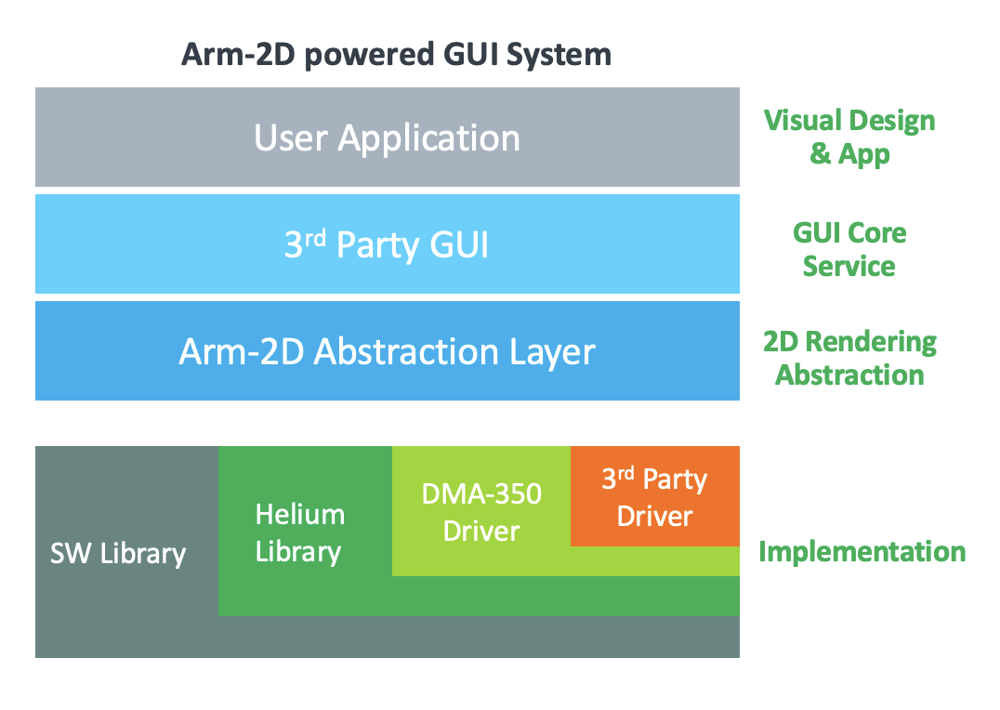
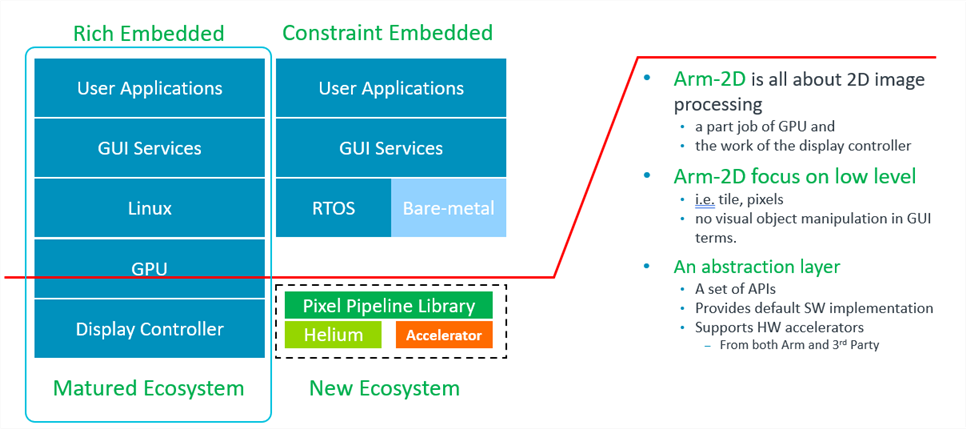
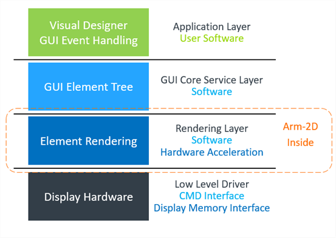
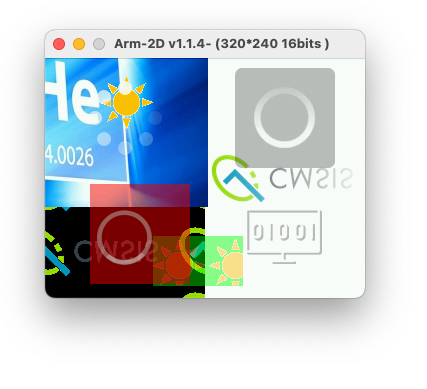
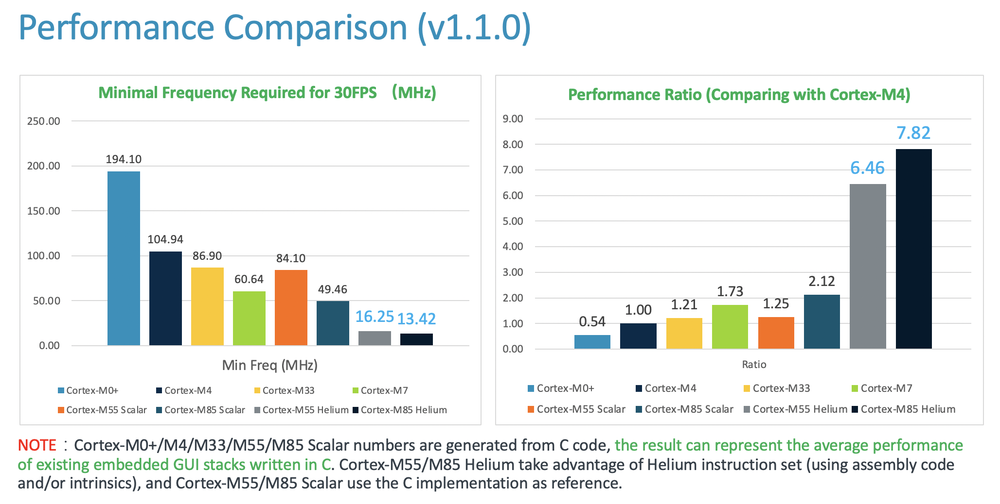

# README {#mainpage} <!-- omit from toc -->

 

## Overview

**Arm-2D is an open-source project for 2.5D image processing on Cortex-M processors.**

- Initial target: IoT endpoint devices, white goods, hand-held devices and wearables, especially for devices with **resource-constrained** and **low power** requirements.
- Initial focus: Graphical User Interface

**Arm-2D consists of:**

- Generic software **pixel pipeline** infrastructure for graphic processing
  - A set of rules for adding new algorithms and colour formats
  - A default software implementation and **SIMD acceleration** when [Helium technology](https://developer.arm.com/architectures/instruction-sets/simd-isas/helium) is available.
  - Supports adding **3rd party hardware accelerators** at low-level in a "feature-agnostic" manner.
- A **CMSIS-Pack** for ease of use
- Examples and Documents

 

**Position in Ecosystem:**

- **Focus on low-level** and works as **a hardware abstraction layer** for 2.5D image processing
- **Arm-2D is NOT a GUI.**
  - No content creation, complex shape drawing or Scalable Vector Graphics (SVG) support
- **Provide conveniences for Arm eco-partners to create value through differentiation**
  - Provide the default implementation for commonly used 2.5D operations and **enable 3rd-parties to accelerate application specific algorithms**

**Current Focus and Objectives:**

- **Help industry partners with technology adoption**
  - Guidance for integration of Arm-2D into graphic stacks
- **Optimization for ultra-small memory footprint**
  - Enable existing Cortex-M processors to use modernized GUI with no or few cost increases.
  - Helping customers to cost-down
- **Adopt algorithms for video input processing**

## Key Messages for You

- **Arm-2D always keeps light-weight**
  - Arm-2D keeps an ultra-low memory footprint for both ROM and RAM

  - Arm-2D uses the commonly available linker features to remove unused functions and data whenever possible.
    - Only functions that are actually used will take up memory

    - Please use feature-specific APIs whenever possible. 
      - For example, if you want to copy an rgb565 picture to a target tile with a source mask without any mirroring, please call `arm_2dp_rgb565_copy_with_src_mask_only()` rather than the generic one, i.e. `arm_2dp_rgb565_copy_with_src_mask()` which takes a mirroring mode as a parameter and keeps all low-level implementations of all possible mirroring modes.
- **Arm-2D always keeps a flat and straightforward framework, i.e. API Wrappers, Frontend and Backend.**

  - API wrappers take user input and generate task descriptors for the following stages.
  - Frontend is responsible for the commonly used and necessary services,
    - for example, region calculation, region clipping, pre-mirroring etc. So the Backend will receive simple, validated and detailed tasks which are friendly for hardware accelerators.
    - **The Frontend is small.**
  - The Backend is the place of Low-level implementations for specific 2D processing algorithms.
    - **Those algorithms are usually unusable if you take them out of arm-2d** because the data are validated in the Frontend, and tasks are simplified in the Frontend also.
    - **The linker will remove unused low-level implementations.**
- **Arm-2D always keeps backward compatibility**
  - Older APIs will still be usable in newer versions (even if they are marked as deprecated)
  - Arm-2D available for ALL Cortex-M processors

## How to Get Started

Potential users of Arm-2D may have different backgrounds and purposes. Whether you are an application engineer for developing drivers from a silicon vendor, a system engineer of a GUI stack, or an application developer, based on the purpose of using Arm-2D, there are two ways to get started:

- [Getting Started as an Application Designer](./documentation/getting_started_as_an_application_designer.md)

	In some resource-constrained systems, the Flash (ROM) and SRAM are limited (e.g. 64K Flash, 12K SRAM), or the memory space left for GUI applications is limited, so such systems cannot afford the cost of a decent GUI stack.
	Meanwhile, such a low-cost system usually won't have a complex graphical user interface, hence application developers can directly use the arm-2d APIs to draw the panels and scenes.

- [Getting Started as a Professional User](./documentation/getting_started_as_a_professional_user.md)

    Application engineers from silicon vendors often need to write drivers for proprietary hardware accelerators. System engineers from GUI software providers may wish to use the APIs provided by Arm-2D to accelerate low-level operations. Engineers focused on embedded video processing may try using the Arm-2D APIs to process the frame buffer just captured from the camera. People from the open-source community may find something interesting to contribute.
    All developers mentioned above are seen as professional users.

## Table of Content

- [Overview](#overview)
- [Key Messages for You](#key-messages-for-you)
- [How to Get Started](#how-to-get-started)
- [Table of Content](#table-of-content)
- [Features](#features)
  - [In this version (ver1.1.4)](#in-this-version-ver114)
  - [New Features Planned in the Future](#new-features-planned-in-the-future)
- [1 Introduction](#1-introduction)
  - [1.1 The Background](#11-the-background)
  - [1.2 The Problems in current solutions](#12-the-problems-in-current-solutions)
- [2 The Platform and Dependency](#2-the-platform-and-dependency)
  - [2.1 Processors and Hardware](#21-processors-and-hardware)
  - [2.2 Dependency](#22-dependency)
- [3 Examples, Benchmark and Templates](#3-examples-benchmark-and-templates)
  - [3.1 Summary](#31-summary)
  - [3.2 Benchmark](#32-benchmark)
- [4 Limitations](#4-limitations)
  - [4.1 The Generic Limitations](#41-the-generic-limitations)
  - [4.2 The Temporary Limitations](#42-the-temporary-limitations)
- [5 Folder Hierarchy](#5-folder-hierarchy)
- [6 Documentation](#6-documentation)
- [7 Feedback](#7-feedback)

## Features

### In this version (ver1.1.4)

The Arm-2D library provides **Low-Level 2D Image Processing Services** mainly used in **Deep Embedded Display system**. The supported features include but not limited to:

- **CMSIS-Pack is available.**
- **Alpha-Blending** / **Masks**
  - With or without Colour-Keying
  - Filling-Colour with an mask and an optional opacity
    - For drawing anti-alias icons/texts in a specified colour
    - Supports A2, A4 and A8 masks
- **Image Copy (Tiling)**
  - With or without Colour-Keying
  - Supports four mirroring modes: No-mirroring, X-mirroring, Y-mirroring and XY-mirroring
  - Supports **masks** on the source side and/or the target side
- **Supported Colour formats**
  - **GRAY8 (8-bit Grayscale)**, **RGB565** and **RGB888**
  - Generic **C8BIT (8bit colour)**, **RGB16** and **RGB32**
  - Converting colour formats among **GRAY8**, **RGB565** and **RGB888**
  - Ready for **monochrome LCD** (the 1bit colour) and **e-ink displays** (the 2bits and 4bits colour formats)
    - Using **Gray8** as the internal processing format and converting to target colour format inside Display Adapter, e.g. `Disp0_DrawBitmap`
- **Generic Partial Frame-buffer (PFB)**
  - Transparent for software/GUI services on upper layers
  - Easy to Use
  - No limitation on screen resolution **(See note)**
  - No limitation on PFB size and shape (it could be a line or a rectangular with any size)  **(See note)**
  - Supports **Dirty Regions** for refreshing specified areas only
  - Supports swapping high and low bytes for RGB16 pixels
  - **[new]** Provide a debug mode for dirty regions
  - **[new]** Support PFB alignment for both width and height.
  - Introduce a **Scene Player** with various scene switching modes (Fade-In-Fade-Out, Slide, Erase etc.)
  - Support various Buffer Modes with a built-in framebuffer pool.
    - Single Buffer/Double-Buffers/Three-Buffers
    - Ready for Direct Mode
    - Enhanced Asynchronous Flushing Support (i.e. DMA + ISR)

​        **NOTE**: As long as the size is smaller than 32767 * 32767.

- **Transform** (i.e. rotation and scaling)
  - Supports Colour-keying
  - Supports an optional **Opacity** ratio
  - Supports Anti-Alias.
    - You can enable it by defining the macro  `__ARM_2D_HAS_ANTI_ALIAS_TRANSFORM__` to `1` at **compile-time**.
  - Supports source masks

- **An Unified and User-Friendly Programmers' Model**
  - APIs can be used in **Synchronous** manner (  **Classic Blocking-code** ) and/or **Asynchronous** manner ( **Event-Driven** )
  - Supports both **bare-metal** and **RTOS** environments
  - Ultra small memory footprint

- **Helper Services for Ease-of-Use**

  - **Timer Services**

    - Timeout: `arm_2d_helper_is_time_out`
    - Time based functions:
      - Liner: `arm_2d_helper_time_liner_slider`
      - Cosine: `arm_2d_helper_time_cos_slider`
      - S-curve: `arm_2d_helper_time_half_cos_slider`

  - **Virtual Resource**

    - Supports loading resources on-demand from external memories that are not mapped into the Cortex-M memory space.

  - **Layout Assistant**

    - Docking Alignments, e.g. `arm_2d_align_centre`, `arm_2d_align_bottom_right` etc.

    - Line Stream Layout, e.g. `__item_line_horizontal` and `__item_line_vertical`

    - Stream Layout (with wrapping), e.g. `__item_horizontal` and `__item_vertical`

  - **[new]** RTOS Helper Services for CMSIS-RTOS2 and RT-Thread

  - Templates

    - Provide templates for user controls and scenes.
    - **[new]** Scene templates for Meter and Watch
    - **[new]** Provide a template for adding new RTOS support.

  - Other Helper services

    - **[new]** A dedicated helper service for transform operations
      - Provide dynamic dirty region tracking
      - Double-buffered Angle and Scale updating

- **Ready and Welcome 3rd party adoption**

  - Successful story: accelerating LVGL as soft-GPU when Helium is ready

### New Features Planned in the Future

- Image Filters, e.g. Generic Anti-aliasing algorithms
- Stretch and Perspective Transform
- Supports DMAC-350

## 1 Introduction

### 1.1 The Background

With more and more smart IoT edge devices introduced to our daily lives, people who are used to the smart-phone-like graphic user interfaces (GUIs) want to have the similar modernized user experience even when using microcontroller-based products. This trend has been long observed and understood by Arm's eco-partners.

As a result, many silicon vendors introduce dedicated hardware accelerators into their microcontroller products to help 2D image processing. Meanwhile, GUI service providers also update their product lines to target microcontroller based GUI applications. Many open-source embedded GUI stacks are hot on GitHub, e.g. [LVGL](https://lvgl.io/).

In fact, using GUI with microcontrollers isn't new at all. Still, until the recent rise of IoT and AI, people find that the simple and monotonous GUI is really unbearable. The pursuit of user experience similar to that of a smartphone has become a basic requirement for products.

On the other hand, seemingly complicated GUIs are often implemented with simple 2D image-copy and -tiling. Even the translucent effect is not unaffordable for microcontrollers that often run under tens or hundreds of MHz.

Technologies used for 2D graphics have been matured as early as the era of 8-bit Gaming Console. Since 8-bit 6502 can achieve fancy graphics effects, why can't the most advanced Cortex-M processor of the day?

### 1.2 The Problems in current solutions

As shown in **Figure 1-2**, Linux based systems have a complete ecosystem that provides GPU drivers and GUI software services. In contrast, resource-constrained embedded systems do not have such luxury. To enhance the MCU ecosystem, Arm-2D is introduced.

**Figure 1-2 Ecosystem Comparison between Rich Embedded and Constraint Embedded System in GUI**

When we look at the traditionally embedded  GUI architecture(as shown in **Figure 1-3** ), there are four layers: 1) the application and designer layer, 2) the GUI software service layer, 3) the rendering layer, and 3) the hardware driver layer.

**Arm-2D focuses on accelerating the low-level 2D image processing**, and will not touch upper layers of the GUI software stacks, hence avoiding competing with GUI service providers in the same ecosystem. In fact, because Arm has proposed an abstraction layer for the low-level 2D image processing, **a whole ecological level of cooperation can be quickly established** between chip manufacturers that provide hardware accelerators and software providers that provide GUI services. **Everyone can concentrate on enlarging their own values**. For example, by adding arm-2d adaptor drivers for their proprietary 2D accelerators silicon vendors can achieve a wide range of support from GUI providers who build/port their GUI stack upon Arm-2D APIs.

**Figure 1-3 The Hierarchy of a Typical Embedded GUI System.**

 

## 2 The Platform and Dependency

### 2.1 Processors and Hardware

**The library is targeting ALL Cortex-M processors with/without various hardware 2D image accelerators:**

- Armv6-M processors: Cortex-M0/M0+/M1/SC000
- Armv7-M processors: Cortex-M3/M4/M7/SC300
- Armv8-M processors: Cortex-M23/M33/Star-MC1/M35P
- Armv8.1-M processors: Cortex-M55/M85

**The library is designed with ACI (Arm Custom Instructions) in mind.** Accelerations implemented with user-defined instructions can be integrated into the library easily without modifying the existing Arm-2D library or upper-layer software.

**The library is designed with 2D image accelerators in mind and following the feature-agnostic principle.**  The Support for accelerators can be added easily without modifying the existing Arm-2D library or upper-layer software.

**The library is designed with resource constraints in mind.** **For Cortex-M processors with 4K~32K SRAM that cannot afford a complete-framebuffer**, Arm-2D introduces a feature called **Generic Partial Framebuffer** enabling those existing MCUs to run GUI applications in a decent frame rate.

### 2.2 Dependency

- The library depends on **CMSIS 5.7.0 and above** (If you want to use Arm-2D with Cortex-M55, CMSIS 5.8.0 is required).
- The library is developed with the **C11** standard and depends on some **widely adopted GCC extensions**.
  - See **section 3.2** for details.
- The library supports **Arm Compiler 6**, **GCC**, **LLVM** and **IAR**
  - See **section 5** for details.

## 3 Examples, Benchmark and Templates

### 3.1 Summary

| Projects                     | Description                                                  | Folder                                | Note |
| ---------------------------- | ------------------------------------------------------------ | ------------------------------------- | ---- |
| \[template\]\[bare-metal\]   | It is a project template for the bare-metal environment.     | examples/\[template\]\[bare-metal\]   |      |
| \[template\]\[cmsis-rtos2\]  | It is a project template for the RTOS environment, which use CMSIS-RTOS2 as an example to show how Arm-2D can work with an RTOS. | examples/\[template\]\[cmsis-rtos2\]  |      |
| \[template\]\[pc\]\[vscode\] | It is a project template for PC (i.e. **MacOS**, **Windows** and **Linux**) using **VS Code + SDL2** | examples/\[template\]\[pc\]\[vscode\] |      |

### 3.2 Benchmark

There is no public 2D image processing benchmark available for microcontrollers. To facilitate the library development and optimization,  we overcome this problem with following methods:

- **Choose the widely used algorithms in embedded GUI as the body of the benchmark**
  - Alpha-blending
  - Colour-Keying
  - Blit
  - Tiling
  - Transform
  - Mirroring
  - Masking
- **Simulate a typical application scenario with sufficient complexity**
  - Background with Texture Tiling (switching mirroring modes every 4 second)
  - Foreground picture
  - Two constructed layers for alpha-blending and tiling with colour keying
  - Moving icons
  - Spinning busy wheel
- **Choose a typical low-cost LCD resolution 320*240 in RGB565**
- **Let those layers float with different angles and speed to cover a sufficient number of conditions.**
- **Record the cycle count used for blending one frame and run 1000 iterations (frames).**

**Figure 1-4 A snapshot of the generic benchmark running on Simulation**

 

- **Use the average cycle count in 1000 iterations as benchmark score.**

  - Based on that, for typical embedded application requirement, we derive a more meaningful metrics called the **Minimal Frequency Required for 30 FPS (MHz)** as shown in **Figure 1-5**.

**Figure 1-5 Performance Comparison among some Cortex-M processors**

 

## 4 Limitations

### 4.1 The Generic Limitations

- The library focus on Cortex-M processors.
- The library supports the following compilers:
  - Arm Compiler 5 (**Deprecated**)
  - Arm Compiler 6
  - GCC
  - LLVM
  - IAR
- The library focus on **Accelerating Low Level Pixel Processing**
  - In principle, the library will **NOT** provide APIs for content creation, such as drawing shapes, text display etc., but simple point drawing and colour-filling APIs .
  - In principle, the library will **NOT** provide data structures or algorithms essential for creating a GUI, for example, the element tree, the GUI message handling and the tree traversal algorithms.

### 4.2 The Temporary Limitations

- The GCC support of Cortex-M55 (helium acceleration) is broken (waiting for tool-chain update).
- The generic Anti-aliasing algorithms haven't been introduced, but anti-alias in transform (i.e. rotation and scaling) is supported.
- The library currently only provides default software algorithms and a **[Helium](https://developer.arm.com/architectures/instruction-sets/simd-isas/helium) based acceleration library**.
  - Although planned and implemented, the [ACI (Arm Custom Instruction)](https://developer.arm.com/architectures/instruction-sets/custom-instructions) acceleration solutions are not open-source for now. Please contact local Arm FAE for details.
- The provided example projects only run on [MPS2](https://developer.arm.com/tools-and-software/development-boards/fpga-prototyping-boards/mps2), [MPS3](https://developer.arm.com/tools-and-software/development-boards/fpga-prototyping-boards/mps3), [FVP](https://developer.arm.com/tools-and-software/open-source-software/arm-platforms-software/cortex-m-platforms-software) and some 3rd party development platforms, e.g. **STM32F746G-Discovery**.
  - Feel free to try the library on your own devices. The library depends on no specific peripheral.
- Most of the example projects are created in MDK.

## 5 Folder Hierarchy

| Folder and File | Type    | Description                                                  |
| :-------------- | ------- | ------------------------------------------------------------ |
| **Library**     | Folder  | This folder contains the source files and header files of the library. |
| **Helper**      | Folder  | This folder contains the source files and header files of helper functions / services. |
| documentation   | Folder  | This folder contains all the documents.                      |
| examples        | Folder  | This folder contains all the examples, controls and templates etc. |
| README          | .md     | The README.md you are currently reading.                     |
| LICENSE         | License | The Apache 2.0 License                                       |
| tools           | Folder  | This folder contains useful utilities for using the library. For example, img2c.py is a python script that converts specified pictures into the arm2-d tile data structures. |

## 6 Documentation

| Name                                                         | Description                                                  | Location                                                     |
| ------------------------------------------------------------ | ------------------------------------------------------------ | ------------------------------------------------------------ |
| API Manual                                                   | An API manual generated by Doxygen                           | *  : [Documentation for latest official release](https://arm-software.github.io/Arm-2D/latest)  * [Documentation for latest development release](https://arm-software.github.io/Arm-2D/main) |
| **README.md**                                                | It is the document that you are reading. It provides basic information and guidance for the arm-2d library. | (root)                                                       |
| **[getting_started_as_an_application_designer.md](./documentation/getting_started_as_an_application_designer.md)** | A guidance for GUI application designers.                    | documentation                                                |
| **[getting_started_as_a_professional_user](./documentation/getting_started_as_a_professional_user.md)** | A guidance for professional users.                           | documentation                                                |
| **[how_to_deploy_the_arm_2d_library.md](./documentation/how_to_deploy_the_arm_2d_library.md)** | A step by step guide that helps you to deploy the library to your existing or new projects. | documentation                                                |
| **[introduction.md](./documentation/introduction.md)**       | A relatively detailed introduction for the library, including basic concepts, programmers' mode etc. | documentation                                                |
| **[how_to_use_layout_assistant.md](/documentation/how_to_use_layout_assistant.md)** | A detailed document introduce the layout assistant helper service. | Documentation                                                |
| **[how_to_use_tile_operations.md](./documentation/how_to_use_tile_operations.md)** | A detailed document elaborates the APIs dedicated to basic tile operations in the arm-2d library. | documentation                                                |
| **how_to_use_alpha_blending_operations.md**                  | A detailed document elaborates the APIs dedicated to alpha-blending services provided by the arm-2d library. | documentation                                                |
| **how_to_use_conversion_operations.md**                      | A detailed document elaborates the APIs dedicated to colour space conversion services provided by the arm-2d library. | documentation                                                |
| **how_to_use_drawing_operations.md**                         | A detailed document elaborates the APIs that provide basic point-drawing and colour-filling services in the arm-2d library. | documentation                                                |
| **[how_to_contribute](./documentation/contribution.md)**     | A guidance for contribution.                                 | documentation                                                |

## 7 Feedback

As mentioned before, this project aims to explore and demonstrate the possibilities of delivering modern GUI using low-cost and resource constraint micro-controllers. We expect that arm-2d could inspire more similar initiatives and engineering practices. Hence, your feedback and thoughts are precious to us.

If you can spend some time and try the library, please feel free to leave your thoughts. It would be nice to cover the following perspectives:

- The target industrial segments in which you want to introduce a GUI using Cortex-M processors

- The resources of your platform, such as the size of the RAM, ROM, system frequency, the average power consumption etc.

- The LCD resolution and target frame rate (FPS)

- Algorithms that you find most useful but missing

- About the device

  - Does it contain HW accelerators for 2D image processing?
  - What is the feature set of this 2D accelerator?
  - Does it include features that are currently missing in this library?

- Any other thoughts or suggestions?

Thank you for your time.

***Arm-2D Development Team.***

12 July 2023
