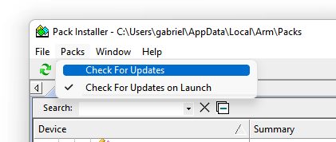
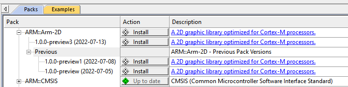
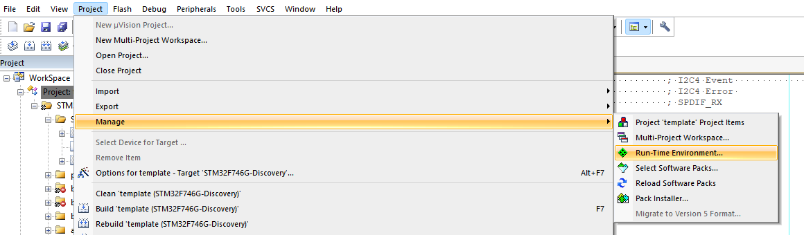
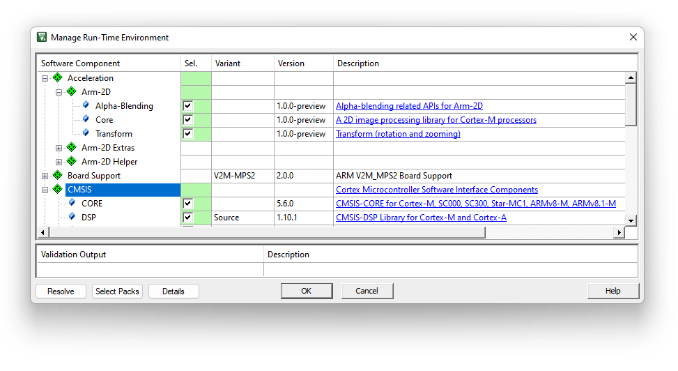
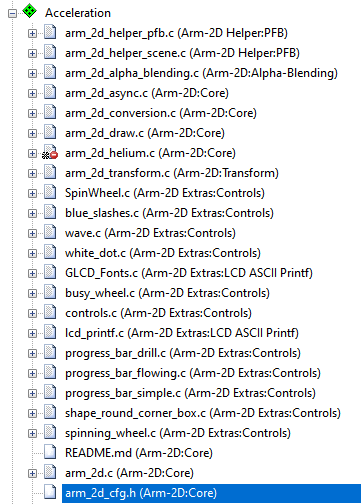
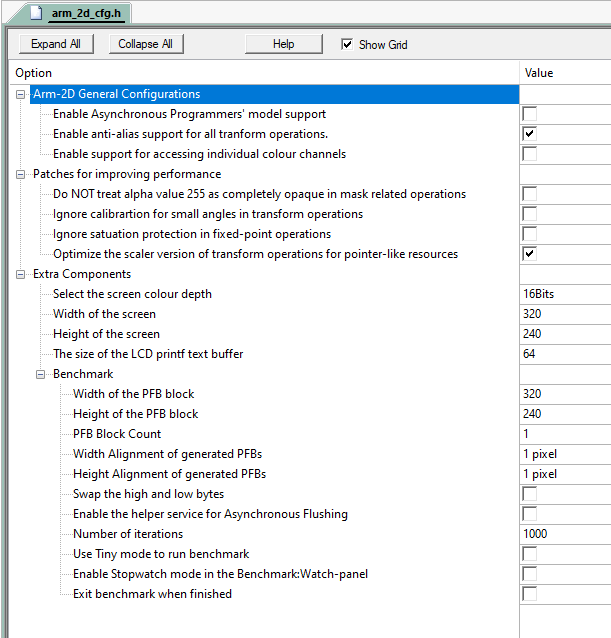
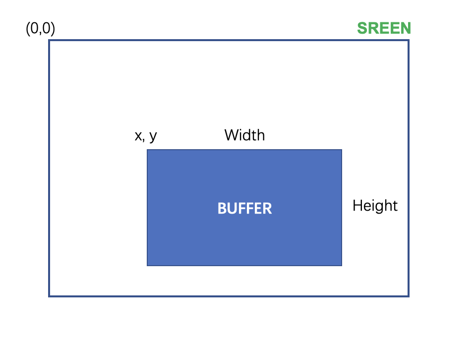
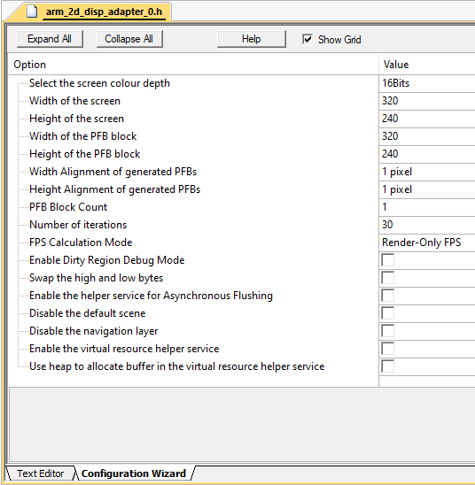
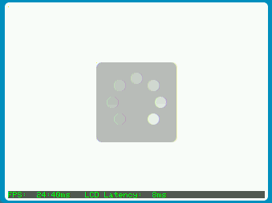

# How to Deploy the Arm-2D Library {#deploy} <!-- omit from toc -->

This document describes how to deploy the **Arm-2D** library to your existing MDK projects. If you are not familiar with **Arm-2D**, please start from the **[README](../README.md)** first.

### Table of Contents

- [1 How to get the Arm-2D](#1-how-to-get-the-arm-2d)
- [2 How to Deploy Arm-2D](#2-how-to-deploy-arm-2d)
  - [2.1 Deploy Using CMSIS-Pack in MDK](#21-deploy-using-cmsis-pack-in-mdk)
- [3 Helper Services and Extras](#3-helper-services-and-extras)
  - [3.1 Preparation](#31-preparation)
  - [3.2 Add Display Adapter Service](#32-add-display-adapter-service)
  - [3.3 Configue the Display Adapter Service](#33-configue-the-display-adapter-service)
  - [3.4 Implement the External Reference Timer](#34-implement-the-external-reference-timer)
  - [3.5 Verifying The Porting Result](#35-verifying-the-porting-result)
- [4 Example Projects](#4-example-projects)


## 1 How to get the Arm-2D

There are three methods to get Arm-2D:

-  Cloning Arm-2D repository on Github using the following command line:

  ```shell
  git clone https://github.com/ARM-software/Arm-2D.git
  ```

- Downloading Arm-2D CMSIS-Pack from the [release page](https://github.com/ARM-software/Arm-2D/releases).

- Checking for Updates in pack-installer and installing the latest Arm-2D packs as shown in **Figure 1-1** and **Figure 1-2**

   **Figure 1-1 Check for Updates in Pack Installer**
   
    

   
   
   **Figure 1-2 Install Arm-2D in Pack Installer**
   
    


## 2 How to Deploy Arm-2D

### 2.1 Deploy Using CMSIS-Pack in MDK

1. Open the Run-Time Environment configuration dialog using menu "Project->Manage->Run-Time Environment" as shown in **Figure 2-6**.

    **Figure 2-6 Open Run-Time Environment Dialog**
    

2. Expand **Acceleration** and select **Core**, **Alpha-Blending** and **Transform** under **Arm-2D** as shown below. Make sure you also select **CMSIS-CORE** and **CMSIS-DSP**.

    **Figure 2-7 Select Arm-2D in RTE**
     
    
3. Enable **C11** and **GNU extension** support in C/C++(AC6) configurations:
   
    **Figure 2-3 Enable "gnu11" in Arm Compiler 6** 
    
     

4. Include the header file `arm_2d.h` in your source code where you want to use the library:

    ```c
    #include "arm_2d.h"
    ```

5. Initialize Arm-2D by calling function `arm_2d_init()` :

    ```c
    static void system_init(void)
    {
        ...
        arm_2d_init();
       ...
    }
    ```

6. Expand Acceleration in the project view and open `arm_2d_cfg.h` as shown in **Figure 2-8**. 

    **Figure 2-8 Find arm_2d_cfg.h in the project view**
    
      
    
    
    
    Open the **Configuration Wizard** and check options available for Arm-2D
    
    **Figure 2-9 Configuration Wizard for Arm-2D**
    
     
    
    **NOTE**: If you want to support **CCCA8888** (i.e. **RGBA8888**), please selet the `Enable support for accessing individual colour channels`.


## 3 Helper Services and Extras

Suppose you want to develop GUI applications directly with Arm-2D. In that case, it implies that you not only use Arm-2D APIs for the framebuffer-based low-level 2D image processing but also want to display the processed result on a screen. An ordinary GUI software stack will provide a dedicated service for connecting a target screen, and users must implement a driver or adapter between the hardware and the service. Such a service usually allows people to refresh the whole screen with a petite frame buffer called partial frame buffer (PFB). This feature is vital for resource-constraint embedded platforms. Arm-2D provide a similar feature through a helper service called Display Adapter Service.

### 3.1 Preparation

Before we start, we have to prepare a low-level flushing function called Disp0_DrawBitmap(). Its prototype is shown below:

```c
int32_t Disp0_DrawBitmap(int16_t x, 
                        int16_t y, 
                        int16_t width, 
                        int16_t height, 
                        const uint8_t *bitmap);
```

Here as shown in **Figure 3-1**:

- `x`,`y` are the absolute coordinates in the target screen
- `width` and` height` describe the size of the rectangular target area
- `bitmap` points to a framebuffer which holds all pixels in a rectangular area with the given `width` and `height`. 


**Figure 3-1 The Scheme of the Low Level Flushing Interface**

 

Suppose the display RAM of your LCD has been mapped into internal 4G memory space. An example of `Disp0_DrawBitmap()` might look like this:

```c
/**
  \fn          int32_t Disp0_DrawBitmap (uint32_t x, uint32_t y, uint32_t width, uint32_t height, const uint8_t *bitmap)
  \brief       Draw bitmap (bitmap from BMP file without header)
  \param[in]   x      Start x position in pixels (0 = left corner)
  \param[in]   y      Start y position in pixels (0 = upper corner)
  \param[in]   width  Bitmap width in pixels
  \param[in]   height Bitmap height in pixels
  \param[in]   bitmap Bitmap data
  \returns
   - \b  0: function succeeded
   - \b -1: function failed
*/
int32_t Disp0_DrawBitmap (uint32_t x, uint32_t y, uint32_t width, uint32_t height, const uint8_t *bitmap) 
{

    volatile uint16_t *phwDes = disp_ram + y * GLCD_WIDTH + x;
    const uint16_t *phwSrc = (const uint16_t *)bitmap;
    for (int_fast16_t i = 0; i < height; i++) {
        memcpy ((uint16_t *)phwDes, phwSrc, width * 2);
        phwSrc += width;
        phwDes += GLCD_WIDTH;
    }

  return 0;
}
```

Here, `disp_ram` points to the memory space reserved for the LCD display RAM.

**IMPORTANT**: 

1. When exiting the `Disp0_DrawBitmap()`, Arm-2D assumes that the target frame buffer has already been flushed to the target screen. 
2. **Please verify the `Disp0_DrawBitmap()` functional correctness without Arm-2d before moving to the next steps.** 


### 3.2 Add Display Adapter Service

Deploying Display Adatper service in MDK is simple:

1. Open RTE dialog (as shown in **Figure 3-2**)
2. Expand `Acceleration::Arm-2D Helper`
3. Select the **PFB** and increase the number of **Display Adapter** to `1`. 
   **NOTE**: If you have multiple screens, please set the number accordingly. 

4. If you see any warning message in yellow, please click the Resolve button. The warning should disappear. 

5. Click **OK** button to close the RTE dialog. 


**Figure 3-2 Selecting Display Adapter Service in RTE**


After that, you will see two files, i.e. `arm_2d_disp_adapter_0.c` and `arm_2d_disp_adapter_0.h` have been added to the project manager under the **Acceleration** group.

**IMPORTANT**: unless necessary, please do **NOT** modify the content of the `arm_2d_disp_adapter_0.c`, as new versions of Arm-2D often introduce new features to the Display Adatper Service, as long as you haven't modified anything in the `arm_2d_disp_adapter_0.c`, updating to the latest version would be an easy task nothing more than right-clicking the file in the project manager and updating to the latest version in the pop-up menu. 

**You have to initalise the Display Adapter service before using it**. 

Include `arm_2d_disp_adapters.h` in your c source code and add the following code to the `main()` function:

```c
#include "arm_2d_helper.h"
#include "arm_2d_disp_adapters.h"
#include "arm_2d_scenes.h"

int main (void) 
{
    ...
    arm_irq_safe {
        arm_2d_init();
    }
 
    /* initialize the display adapter 0 service */
    disp_adapter0_init();
    
    while (1) {
        /* the task function of the display adapter 0 service */
        disp_adapter0_task();
    }
}
```

Or the thread function if you want to run Arm-2d in an RTOS environment:

```c
#include "arm_2d_helper.h"
#include "arm_2d_disp_adapters.h"
#include "arm_2d_scenes.h"

#ifndef LCD_TARGET_FPS
#   define LCD_TARGET_FPS       30
#endif

__NO_RETURN
void app_2d_main_thread (void *argument) 
{
    arm_irq_safe {
        arm_2d_init();
    }
 
    /* initialize the display adapter 0 service */
    disp_adapter0_init();

    while(1) {
        //! retrieve the number of system ticks
        uint32_t wTick = osKernelGetTickCount();        
        while(arm_fsm_rt_cpl != disp_adapter0_task());
        
        //! lock frame rate
        osDelayUntil(wTick + (1000 / LCD_TARGET_FPS));
    }

    //osThreadExit();
}
```


### 3.3 Configue the Display Adapter Service

You should configure the Display Adapter service before using it. All the configurations of a Display Adapter service are stored in the corresponding header file, e.g. `arm_2d_disp_adapter_0.h`. In MDK, all configuration work can be done through the GUI wizard, as shown in **Figure 3-3**. 

**Figure 3-3 Configure the Display Adapter Using the Wizard**

 


There are many options available in the list, and we only explain those important and commonly used ones here:

**Table 3-1 The Important and Commonly Used Options of the Display Adapter Service**

| Options                                             | Value                    | Default         | Description                                                  |
| --------------------------------------------------- | ------------------------ | --------------- | ------------------------------------------------------------ |
| Select the screen colour depth                      | 8bits/16bits/32bits      | 16bits          | The number of bits per pixel. For monochrome LCD and e-ink LCD, please select the 8bits. |
| Width of the screen                                 | 8...32767                | 320             | The width of the target screen                               |
| Height of the screen                                | 8...32767                | 240             | The height of the target screen                              |
| Width of the PFB block                              | 1...32767                | 320             | The width of a partial frame buffer (PFB). If possible, please use the screen width here. |
| Height of the PFB block                             | 1...32767                | 240             | The height of a partial frame buffer (PFB). It is recommended to start from 1/10 of the height of the screen. If possible, do not use a value smaller than 8. |
| Width Alignment of generated PFBs                   | 1/2/4...128 pixels       | 1 pixel         | The horizontal pixel alignment of the PFBs sending to the `DispN_DrawBitmap()` for flushing. It is important for LCDs that have certain pixel alignment requirements. For example, 8 pixel alignment for monochrome LCDs and 4 pixel alignment for e-inks. |
| Height Alignment of generated PFBs                  | 1/2/4...128 pixels       | 1 pixel         | The vertical pixel alignment of the PFBs sending to the `DispN_DrawBitmap()` for flushing. It is important for LCDs that have certain pixel alignment requirements. For example, 8 pixel alignment for some 12864 monochrome LCDs. |
| PFB Block Count                                     | 1...32767                | 1               | The number of PFB blocks in the pool. Please set it to `2` or more when using Asynchornose flushing mode; otherwise, keep it as `1`. |
| Number of iterations                                | 0...32767                | 30              | Calculate the real-time FPS for every specified number of frames. Set it to `0` to disable the real-time FPS calculation. |
| FPS Calculation Mode                                | Render-Only FPS/Real FPS | Render-Only FPS | **Render-Only FPS**: record the time used by the renderer and use it to calculate the FPS without taking LCD latency into consideration. <br />**Real FPS**: calculate the real FPS people actually see on the screen. |
| Swap the high and low bytes                         | Select/Unselect          | Unselect        | Some RGB565 LCDs require swapping the high and the low bytes for each pixel. Please **ONLY** enable this option when there is no hardware solution to swap the high and low bytes. |
| Enable the helper service for Asynchronous Flushing | Select/Unselect          | Unselect        | By selecting this option, a dedicated helper service will be provided for asynchronous flushing mode. For more, please read the guidance in the header file. |
| Disable the default Scene                           | Select/Unselect          | Unselect        | A Display Adapter brings a default scene for indicating successful porting. You can disable it by selecting this option. |
| Disable the navigation layer                        | Select/Unselect          | Unselect        | A Display Adapter uses the navigation layer (which is floating above the content created by users) to show real-time FPS and version info. You should disable it before the product releasing or disable it to add your own navigation layer. |


**NOTE**:

- If the target device cannot afford the full frame buffer, please set the PFB size (i.e. width and/or height) to a smaller value. **We recommend you start with a 1/10 full frame buffer**, as it actually isn't 10x slower than using a full frame buffer. 
- For **monochrome LCDs**, you should use 8-bit colour depth and pack every 8 pixels into one byte in the `Disp0_DrawBitmap()`. Don't forget to set the PFB alignment to 8 horizontally or vertically depending on the monochrome LCD pixel layout. 
- For **2-bit e-ink LCDs**, you should use 8-bit colour depth and pack every 4 pixels into one byte in the `Disp0_DrawBitmap()`. Don't forget to set the PFB alignment to 4 horizontally or vertically depending on the e-ink LCD pixel layout. 
- For **4-bit e-ink LCDs**, you should use 8-bit colour depth and pack every 2 pixels into one byte in the `Disp0_DrawBitmap()`. Don't forget to set the PFB alignment to 2 horizontally or vertically depending on the e-ink LCD pixel layout. 
- Please make sure the stack size is no less than 3K Bytes. 


### 3.4 Implement the External Reference Timer

Arm-2D helper service relies on an external reference timer which we should implement:

**Table 3-2 The Interface for Accessing the External Timer**

| Interface Prototype                                        | Description                                                  |
| ---------------------------------------------------------- | ------------------------------------------------------------ |
| int64_t arm_2d_helper_get_system_timestamp(void)           | a function that returns the number of ticks (timestamp) of the reference timer since reset. |
| uint32_t arm_2d_helper_get_reference_clock_frequency(void) | the frequency of the reference timer.                        |


**We highly recommand you to install perf_counter from Pack-Installer, [Keil Website](https://www.keil.arm.com/packs/) or [its Github repo](https://github.com/GorgonMeducer/perf_counter/releases) to simplify this process.** You have to initialize the perf_counter before using Arm-2D. For more, please read the [guidance here](https://github.com/GorgonMeducer/perf_counter/blob/main/README.md).


### 3.5 Verifying The Porting Result

After finished steps above, if everything goes well, you should see a screen as shown in **Figure 3-4**.  If the colour doesn't look right and the LCD uses RGB565, try to swap the high and low bytes for each pixel.  

**Figure 3-4 The Look of The Default Scene In A Successful Porting**

 


If you encounter any problems, please feel free to raise an issue. 

Enjoy.


## 4 Example Projects

**Table 3-1 Summary**


| Projects                     | Description                                                  | Folder                                | Note |
| ---------------------------- | ------------------------------------------------------------ | ------------------------------------- | ---- |
| \[template\]\[bare-metal\]   | It is a project template for the bare-metal environment.     | examples/\[template\]\[bare-metal\]   |      |
| \[template\]\[cmsis-rtos2\]  | It is a project template for the RTOS environment, which use CMSIS-RTOS2 as an example to show how Arm-2D can work with an RTOS. | examples/\[template\]\[cmsis-rtos2\]  |      |
| \[template\]\[pc\]\[vscode\] | It is a project template for PC (i.e. **MacOS**, **Windows** and **Linux**) using **VS Code + SDL2** | examples/\[template\]\[pc\]\[vscode\] |      |

