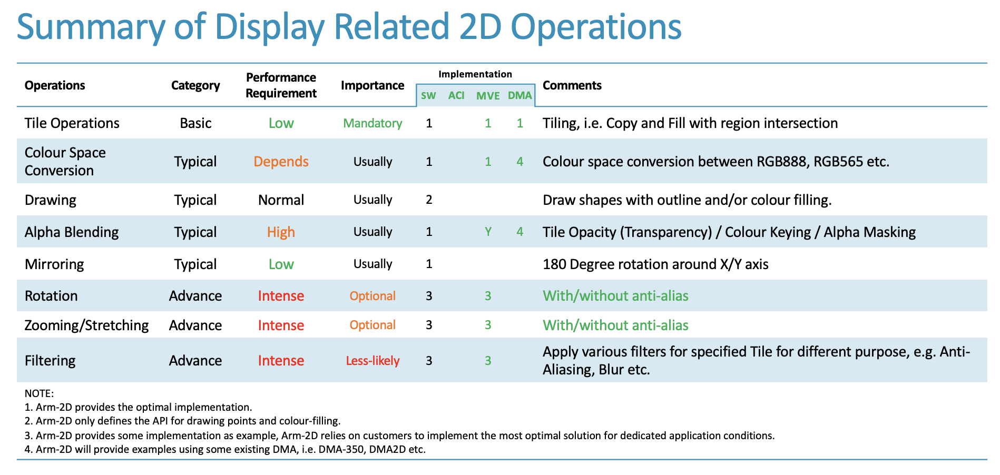
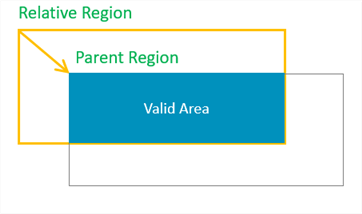
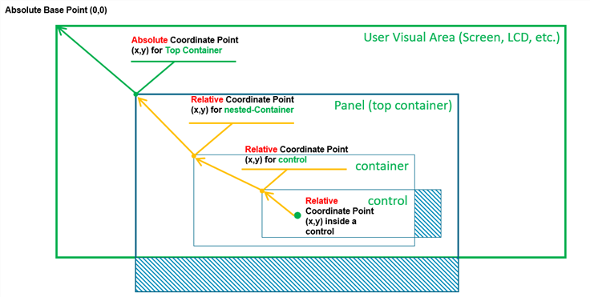
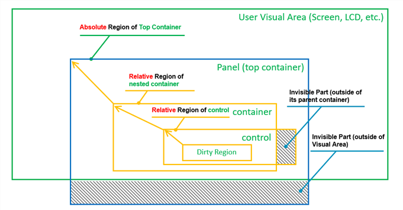
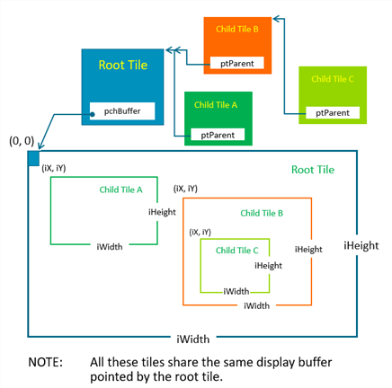
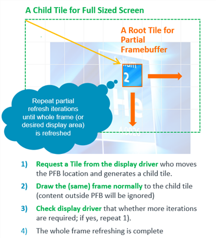

# Introduction for Arm-2D {#intro} <!-- omit from toc -->

This document explains the basic concepts of Arm-2D. It doesn't matter whether you have read the **README** in the root directory. The content is suitable for everyone. 


## 1 Overview

At the beginning of our adventure, you might have a lot of questions, such as

- What is Arm-2D?
- What problems does it solve?
- Who are the target audiences?
- What does Arm-2D consist of?
- What about the development environment?

You will find the answers in the following sections. 

### Table of Contents <!-- omit from toc -->
- [1 Overview](#1-overview)
  - [1.1 What is Arm-2D](#11-what-is-arm-2d)
  - [1.2 Target Audiences](#12-target-audiences)
    - [1.2.1 GUI Service Provider](#121-gui-service-provider)
    - [1.2.2 Silicon Vendor](#122-silicon-vendor)
    - [1.2.3 Embedded Application Designers](#123-embedded-application-designers)
  - [1.3 Arm-2D Libraries](#13-arm-2d-libraries)
    - [1.3.1 Standard Software Implementation](#131-standard-software-implementation)
    - [1.3.2 Helium Acceleration](#132-helium-acceleration)
    - [1.3.4 Third-party Implementation](#134-third-party-implementation)
    - [1.3.5 Arm Custom Instruction Support](#135-arm-custom-instruction-support)
  - [1.4 Scope and Limitations](#14-scope-and-limitations)
    - [1.4.1 Scope](#141-scope)
    - [1.4.2 Limitations](#142-limitations)
  - [1.5 Operation Categories](#15-operation-categories)
  - [1.6 Folder Structures](#16-folder-structures)
- [2 Basics](#2-basics)
  - [2.1 Region](#21-region)
    - [2.1.1 Location](#211-location)
    - [2.1.2 Size](#212-size)
  - [2.2 Bounding Box Model](#22-bounding-box-model)
    - [2.2.1 Absolute Location and Relative Location](#221-absolute-location-and-relative-location)
    - [2.2.2 Absolute Region and Relative Region](#222-absolute-region-and-relative-region)
  - [2.3 Tile](#23-tile)
    - [2.3.1 Root Tile](#231-root-tile)
    - [2.3.2 Child Tile](#232-child-tile)
    - [2.3.3 Partial Frame Buffer](#233-partial-frame-buffer)
  - [2.4 Colour](#24-colour)
  - [2.4 API Usage Modes](#24-api-usage-modes)
    - [2.4.1 Synchronous Mode](#241-synchronous-mode)
    - [2.4.2 Asynchronous Mode](#242-asynchronous-mode)
- [3 API Summary for commonly used APIs](#3-api-summary-for-commonly-used-apis)
  - [3.1 Tile Operations](#31-tile-operations)
  - [3.2 Colour Space Conversion](#32-colour-space-conversion)
  - [3.3 Alpha Blending and Masks related](#33-alpha-blending-and-masks-related)
  - [3.4 Transform (Rotation/Scaling)](#34-transform-rotationscaling)
  - [3.5 Drawing](#35-drawing)
  - [3.6 Filters](#36-filters)


### 1.1 What is Arm-2D

If you want to design GUI applications in Linux, you don’t have to face hardware directly. The Linux ecosystem provides you with all necessary software components, including GPU drivers, GUI stacks and many handy reference designs.

Unfortunately, if you are an embedded developer using Cortex-M devices, you must face various display hardware directly. Even worse, you might face various non-standard 2D graphics accelerators from different silicon vendors. Many GUI stacks are available for embedded applications, but most of them are not ready for your target device immediately. As a result, you have to do the porting work first. In summary, using GUI in the Cortex-M system is feasible, but there is a lot of low-level work beforehand.

**Figure 1-1 Ecosystem Comparison between Rich Embedded and Constraint Embedded System in GUI**


**Arm-2D is not about reinventing a GUI or competing with the existing GUI stacks.** The problem Arm-2D wants to solve is how to **provide a unified low-level hardware acceleration interface for all GUI stacks** so that high-level software service providers are freed from writing drivers for endlessly emerging non-standard hardware. Once Arm-2D becomes a bridge between GUI providers and chip manufacturers, everyone can do their best.

**Figure 1-2 The Hierarchy of a Typical Embedded GUI System.**


**Arm-2D focuses on low-level 2D image processing and provides a unified software interface for the various 2D accelerators.**

### 1.2 Target Audiences

There are three types of participants in arm-2d: GUI service providers, silicon vendors, and embedded software developers.

#### 1.2.1 GUI Service Provider

GUI service providers can benefit from Arm-2D, which provides a standard interface for commonly used hardware acceleration.  GUI service providers can use Arm-2D to get low-level acceleration by default.  As a result, they are freed from writing drivers for hardware; and concentrate on improving the software and providing customisation services for their VIP customers.

#### 1.2.2 Silicon Vendor

Semiconductor manufacturers can benefit from Arm-2D. To save the efforts of learning new architectures, programmers want to use microcontrollers under the same architecture, and in most cases, that means using Cortex-M processors. Since devices use the same processor architecture, semiconductor manufacturers are motivated to introduce proprietary peripherals for differentiation. Introducing dedicated accelerators for 2D graphics has become the new trend. 
While differentiation in hardware brings benefits to end-users, it also inevitably introduces the problem of software fragmentation. Introducing a hardware abstract layer to mitigate the issue is common practice in software engineering. Arm-2D is such an abstract layer for various 2D graphic accelerations. 

In an ideal condition, chip manufacturers only need to implement arm-2d compliant drivers for their hardware accelerators, and this is sufficient to get support from the mainstream GUI stacks. 

#### 1.2.3 Embedded Application Designers

Most embedded software developers use devices with constrained resources. A typical system has less than 64KB FLASH and 4~32K SRAM. As a reference, a standard low-cost serial LCD (320*240 resolution and 65K colour) requires 150KB RAM for the display buffer, which is unaffordable. 

Also, for such microcontrollers, most of the existing GUI stacks are too expensive to use in terms of memory footprint. On the other hand, many GUI applications are so simple that even some home-brew implementations are good enough to fulfil the requirements. In such cases,  most existing GUI stacks are too heavy. 

When one wants to build a GUI-based application from scratch with such resource-constrained microcontrollers, you either completely give up the idea of GUI or make trade-offs among the following options:

- Implement GUI using only simple shapes, such as points, lines, colour blocks, etc.
- Bearing with low bandwidth in operations: read pixels from LCD's internal display buffer, modify and write them back
- Only copy/send pre-stored pictures in ROM to LCD without any processing.
- Using a technique called the Partial-Frame-Buffer to practise time-space-exchanging

In conclusion, **in the past, it was hard to implement a modern-looking GUI in a bare-metal environment**. And now, Arm-2D provides a series of easy-to-use APIs to help users implement desired graphic effects using the so-called Partial-Frame-Buffer helper service. It is worth mentioning that the **PFB-backed design paradigm introduced by Arm-2D is transparent to upper-layer software**, which dramatically simplifies the application development in a bare-metal environment, i.e. **users can design applications as if there is a full frame buffer.**

**In summary, Arm-2D enables many devices (traditionally unsuitable for modern-looking GUI) to implement a modern-looking GUI with a small memory footprint.**


### 1.3 Arm-2D Libraries

#### 1.3.1 Standard Software Implementation

As a starting point, Arm-2D provides a default software implementation for all algorithms. These software implementations are mainly written in the C language and occasionally include some local assembly acceleration. This ensures that Arm-2D can be used directly on all Cortex-M processors without modification.

#### 1.3.2 Helium Acceleration

If you are using an Armv8.1-M processor, such as Cortex-M55, as long as you enable Helium support with compilation options, **Arm-2D library will automatically use Helium technology for acceleration**.

#### 1.3.4 Third-party Implementation

Arm-2D has provided standard ways to add support for various third-party hardware accelerators. Although not included now, In the future, we will introduce templates, examples and documents to show how to add support for third-party hardware accelerators. 

#### 1.3.5 Arm Custom Instruction Support

Arm-2D has provided standard ways to add support for 2D image processing algorithms accelerated with customised instructions. Although not included now, In the future, we will introduce templates, examples and documents to show how. 


### 1.4 Scope and Limitations

#### 1.4.1 Scope

- The Arm-2D should fulfil the requirements of Smart-Watch applications
  - at most 640 * 640 resolution, 32bit colours
  - 60 FPS refresh rate
  - Provide support for rotation, anti-alias filters etc.
- The Arm-2D should fulfil the requirements of deep embedded applications in constraint environment
  - A typical MCU with less than 64K Flash and 4~32K SRAM.
  - System frequency is around 48MHz or above.
  - For applications that tolerate low frame-rate ranging from 1FPS to 30FPS.
  - Deliver modern-looking GUI using Partial Frame-buffer (as small as 8*8 PFB, 128Bytes in 16bit colour).
    - Put no limitation on supported resolution size (exchanging RAM with low frame-rate).

#### 1.4.2 Limitations

- The library focus on Cortex-M processors in principle.
- The library should be compiled with the following compilers:
  - Arm Compiler 5
  - Arm Compiler 6
  - GCC
  - LLVM
  - IAR
- The library focus on **Low Level Pixel Processing Acceleration**
  - In principle, the library will **NOT** provide APIs for content creation, such as drawing shape, text display and etc, but simple draw point APIs. 
  - In principle, the library will **NOT** provide data structures or related algorithms which are essential for creating a GUI, for example, element tree, GUI message handling and the tree traversal algorithms.

**NOTE: For the temporary limitations in current version, please check section 5.2 in [README](./../README.md) for details.**


### 1.5 Operation Categories

**Table 1-1 Summary of Operation Categories.** 



### 1.6 Folder Structures

**Table 1-2 The Folder Structure of Arm-2d Root** 

| Folder and File                  | Type    | Description                                                  |
| :------------------------------- | ------- | ------------------------------------------------------------ |
| **Library**                      | Folder  | This folder contains the source files and header files of the library. |
| **Helper**                       | Folder  | This folder contains the source files and header files of helper functions / services. |
| documentation                    | Folder  | This folder contains all the documents.                      |
| examples                         | Folder  | This folder contains all the example code / projects.        |
| README                           | .md     | The README.md you are currently reading.                     |
| how_to_deploy_the_arm_2d_library | .md     | A step by step guidance helping you to deploy the Arm-2D library to your projects. |
| LICENSE                          | License | The Apache 2.0 License                                       |
| tools                            | Folder  | This folder contains some useful utilities for using the library. For example, img2c.py is a python script that convert a specified picture into the tile data structure. |


## 2 Basics

Arm-2D defines some basic data structures for ease of use, providing a unified description method for various graphic resources and simplifying the parameters that need to be passed to 2D processing APIs. This chapter will introduce some basic concepts and corresponding data structures that you must know to work with the Arm-2D library. Arm-2D systematically introduces a Bounding Box Model to provide more sophisticated and easy to use 2D graphics operations.

### 2.1 Region

Region is a rectangular area described by the Location (the coordinates of the upper left corner) and the Size information.

```c
typedef struct arm_2d_region_t {
    implement_ex(arm_2d_location_t, tLocation);
    implement_ex(arm_2d_size_t, tSize);
} arm_2d_region_t;
```

**Figure 2-1 Region with Location and Size ** 

 

#### 2.1.1 Location

The coordinate of the Region is defined by the vertices at the upper left corner of the bit rectangle. Its data structure is as follows:

```c
typedef struct arm_2d_location_t {
    int16_t iX;
    int16_t iY;
} arm_2d_location_t;
```

Different from the general Cartesian coordinate system, in graphics, the Y-axis is usually mirrored in the opposite direction, which means that the lower the Y coordinate is, the larger the Y coordinate is. In the Bounding Box Model that will be introduced later, we will understand that the **coordinates of a Region can be negative**, representing the position of the current Region relative to the starting point of its parent Region.

**Figure 2-2 When Location has a negative coordinates.** 

 

As shown in **Figure 2-2**, when the ***x*** and ***y*** coordinates of a Region are both negative, it actually has a considerable area outside (upper left corner) of its parent Region. When we try to find the intersection of the current Region and its parent Region, we will find that only part of the region is valid.

#### 2.1.2 Size

The size information of the Region is described by the Height and Width together. The data structure is defined as follows:

```c
typedef struct arm_2d_size_t {
    int16_t iWidth;
    int16_t iHeight;
} arm_2d_size_t;
```

Although a signed type ***int16_t*** is used to describe the width and height, negative numbers are meaningless and should be avoided.

### 2.2 Bounding Box Model

The so-called Bounding Box Model describes the affiliation among Regions, which is often used to describe the relationship between containers and visual elements. 

In a GUI stack, the Bounding Box Model usually talks about more complex stuff, such as the border's width, the margin inside a container border, the padding of / distance between the elements inside a container etc. Arm-2D does ***NOT*** cares about these details but only describes the simple relationship between a container and the elements inside.

#### 2.2.1 Absolute Location and Relative Location

In Arm-2d, we consider panels or windows as containers, and the Locations of the panels and the windows are their coordinates in the display buffer. **We call this kind of location information that directly describes the coordinates in a display buffer as an Absolute Location**. In **Figure 2-3**, the panel (top container) coordinates are absolute coordinates.

The coordinates of the elements inside a container are described as **coordinates relative to the upper left corner of the parent container**. We call this kind of Locations the **Relative Locations**. In addition to that, since the container is only a special element, container nesting becomes possible.  In **Figure 2-3**, the two innermost Regions have Relative Locations.

**Figure 2-3 A Typical Example of Absolute Locations and Relative Locations**

 

#### 2.2.2 Absolute Region and Relative Region

If a Region has absolute Location, it is an **Absolute Region**; similarly, if a  Region has relative Location, it is a **Relative Region**.

**Figure 2-4 A Typical Example of Absolute Regions and Relative Regions**

 

When we use these relative and absolute information to perform visual area calculations, it is easy to exclude those areas that are actually invisible to the user from various graphic operations, thereby improving the overall 2D processing performance (as shown in **Figure 2-4** ).


### 2.3 Tile

Tile is the smallest unit of various 2D operations in Arm-2D. The Tile data structure consists of three parts:

- Feature of the Tile
- Region of the Tile and 
- Pointers

The C definition of a the Tile data structure is shown below:

```c
typedef struct arm_2d_tile_t arm_2d_tile_t;
struct arm_2d_tile_t {
    implement_ex(struct {
        uint8_t    bIsRoot              : 1;          //!< is this tile a root tile
        uint8_t    bHasEnforcedColour   : 1;          //!< does this tile contains enforced colour info
        uint8_t    bDerivedResource     : 1;          //!< indicate whether this is a derived resources (when bIsRoot == 0)
        uint8_t    bVirtualResource     : 1;          //!< indicate whether the resource should be loaded on-demand
        uint8_t                         : 4;
        uint8_t                         : 8;
        uint8_t                         : 8;
        arm_2d_color_info_t    tColourInfo;           //!< enforced colour
    }, tInfo);
    implement_ex(arm_2d_region_t, tRegion);           //!< the region of the tile
    union {
        /* when bIsRoot is true, phwBuffer is available,
         * otherwise ptParent is available
         */
        arm_2d_tile_t       *ptParent;                //!< a pointer points to the parent tile
        uint8_t             *pchBuffer;               //!< a pointer points to a buffer in a 8bit colour type
        uint16_t            *phwBuffer;               //!< a pointer points to a buffer in a 16bit colour type
        uint32_t            *pwBuffer;                //!< a pointer points to a buffer in a 32bit colour type
        
        intptr_t            nAddress;                 //!< a pointer in integer
    };
};
```


**Table 2-1 The Functionality of Each Members In *arm_2d_tile_t***

| Member                   | Category     | Type                      | Description                                                  | Note                                                         |
| ------------------------ | ------------ | ------------------------- | ------------------------------------------------------------ | ------------------------------------------------------------ |
| ***bIsRoot***            | Feature Info | bit-field                 | This bit indicates that whether a tile is a root tile or not. If it is "***1***", the target tile is a root tile that contains a pointer pointing to a display buffer. If it is "***0***", the target tile is a child tile that contains a pointer pointing to a parent tile which **NOT** necessarily to be a root tile. | See **[section 2.3.1](#231-root-tile)** and **[2.3.2](#232-child-tile)** for details. |
| ***bHasEnforcedColour*** | Feature Info | bit-field                 | This bit indicates that whether a tile explicitly contains a descriptor for pixel colour. When this bit is set, ***tColourInfo*** is valid; otherwise, it is seen as containing no valid information.  If a Tile is used as the source tile of any Colour Conversion Operations, this bit has to be set and ***tColourInfo*** should contain a valid description. | For most of the Arm-2d operations, when this bit is zero, arm-2d API will use its own implicit understanding about the tile colour.  For example, ***arm_2d_rgb16_tile_copy()*** has describe its implicit colour, i.e. ***RGB16*** in function name, hence even ***bHasEnforcedColour*** is set and ***tColourInfo*** contains valid information, the operation still considers both the source and target tiles using ***RGB16***. |
| ***bDerivedResource***   | Feature Info | bit-field                 | This bit indicates whether a child tile is used as a resource. | When creating a resource from a existing tile, you must set this bit to "1".  **It is only valid when bIsRoot is "0"**. |
| ***bVirtualResource***   | Feature Info | bit-field                 | This bit indicates whether the resource should be loaded on-demand | **It is only set this bit when bIsRoot is "1" and the data type is arm_2d_vres_t**. |
| ***tColourInfo***        | Feature Info | ***arm_2d_color_info_t*** | When ***bHasEnforcedColour*** is set, tColourInfo should contain a valid descriptor about the colour used in the target Tile. | See **[section 2.4](#24-colour)** for details.               |
| ***tRegion***            | Region       | ***arm_2d_region_t***     | Depends on the type of a given tile, ***tRegion*** has a different meaning. | See **[section 2.3.1](#231-root-tile)** and **[2.3.2](#232-child-tile)** for details. |
| ***ptParent***           | Pointers     | ***arm_2d_tile_t \****    | When ***bIsRoot*** is "***0***", this pointer is used to point the parent tile. | See **[section 2.3.1](#231-root-tile)** for details.         |
| ***phwBuffer***          | Pointers     | ***uint16_t \****         | When ***bIsRoot*** is "***1***", this pointer is used to point to a display buffer that contains 16-bit pixels. | See **[section 2.3.1](#231-root-tile)** for details.         |
| ***pwBuffer***           | Pointers     | ***uint32_t \****         | When ***bIsRoot*** is "***1***", this pointer is used to point to a display buffer that contains 32-bit pixels. | See **[section 2.3.1](#231-root-tile)** for details.         |
| ***pchBuffer***          | Pointers     | ***uint8_t \****          | When ***bIsRoot*** is "***1***", this pointer is used to point to a display buffer that contains pixels that have less or equals to 8bits. | See **[section 2.3.1](#231-root-tile)** for details.         |


#### 2.3.1 Root Tile

A Root tile is a kind of tiles that directly contain the display buffer, and its feature bit `bIsRoot` is set, according to the pixel types used in the display buffer to which corresponding pointers should be used. For more details, please refer to **Table 2-1**.

It is worth emphasizing that for a root Tile, its Location coordinate must be ***(0,0)***; otherwise, it is considered illegal.

With the help of [C99 designator](https://gcc.gnu.org/onlinedocs/gcc/Designated-Inits.html), a tile structure can be initialised clearly and easily. The following example shows a root tile `c_tPictureCMSISLogo` representing a ***RGBA8888*** bitmap stored in a constant array called `c_bmpCMSISLogo[]`. Note that because the bitmap and the tile structure are designated as constants, it is highly likely that a compiler will use ROM rather than RAM to store them and keep a small RAM footprint. 

```c
/*! picture cmsis_logo */
extern const uint8_t c_bmpCMSISLogo[163 * 65 * sizeof(uint32_t)];
const static arm_2d_tile_t c_tPictureCMSISLogo = {
    .tRegion = {
        .tSize = {
            .iWidth = 163,
            .iHeight = 65
        },
    },
    .tInfo = {
        .bIsRoot = true,
        .bHasEnforcedColour = true,
        .tColourInfo = {
            .chScheme = ARM_2D_COLOUR_RGBA8888,
        },
    },
    .pwBuffer = (uint32_t *)c_bmpCMSISLogo,
};
```

In fact, with the help of some macro templates, we can use Tile to implement framebuffers with a given size:

```c
#define __declare_tile(__NAME)                                                  \
            extern const arm_2d_tile_t __NAME;
#define declare_tile(__NAME)            __declare_tile(__NAME)

#define dcl_fb(__name)                  declare_tile(__name)

#define __impl_fb(__name, __width, __height, __type, ...)                       \
            ARM_NOINIT static __type                                            \
                __name##Buffer[(__width) * (__height)];                         \
            const arm_2d_tile_t __name = {                                      \
                .tRegion = {                                                    \
                    .tSize = {(__width), (__height)},                           \
                },                                                              \
                .tInfo.bIsRoot = true,                                          \
                .pchBuffer = (uint8_t *)__name##Buffer,                         \
                __VA_ARGS__                                                     \
            }
            
#define impl_fb(__name, __width, __height, __type, ...)                         \
            __impl_fb(__name, __width, __height, __type, ##__VA_ARGS__)
```

For example, we can create two framebuffers with size **100\*100** and ***200\*50*** respectively and using colour `arm_2d_color_rgb565_t` for pixels:

```c
dcl_fb(c_tLayerA)
impl_fb(c_tLayerA, 100, 100, arm_2d_color_rgb565_t);

dcl_fb(c_tLayerB)
impl_fb(c_tLayerB, 200, 50, arm_2d_color_rgb565_t);
```

These layers are stored in RAM, which are used as sources and targets for 2D operations. 

Note that in the aforementioned macro template, we use `ARM_NOINIT` to decorate the display buffer, its definition is shown below:

```c
#ifndef ARM_NOINIT
#if     defined(__IS_COMPILER_ARM_COMPILER_5__)
#   define ARM_NOINIT           __attribute__( ( section( ".bss.noinit"),zero_init) )
#elif   defined(__IS_COMPILER_ARM_COMPILER_6__)
#   define ARM_NOINIT           __attribute__( ( section( ".bss.noinit")) )
#elif   defined(__IS_COMPILER_IAR__)
#   define ARM_NOINIT           __no_init
#elif   defined(__IS_COMPILER_GCC__) || defined(__IS_COMPILER_LLVM__)
#   define ARM_NOINIT           __attribute__(( __section__( ".bss.noinit")))
#else
#   define ARM_NOINIT
#endif
#endif
```

It is clear that for the Arm Compiler 5 and Arm Compiler 6, `ARM_NOINIT` puts the target variable into a ***ZI*** section called `.bss.noinit` which later should be placed in an execution region with ***[UNINIT](https://developer.arm.com/documentation/101754/0616/armlink-Reference/Scatter-File-Syntax/Execution-region-descriptions/Execution-region-attributes)*** feature in a scatter-script, for example:

```
LR_ROM __ROM_BASE __ROM_SIZE  {                           
    ...
    ; Reserve empty region for stack
    ARM_LIB_STACK __RAM1_BASE ALIGN 8 EMPTY __STACK_SIZE { 
    }

    RW_RAM1 +0 __RAM1_RW_SIZE {
        * (+RO-DATA)
        * (+RW +ZI)
    }

    RM_RAM_NOINIT +0 UNINIT {
        * (.bss.noinit)
    }
    
    ; Reserve empty region for heap
    ARM_LIB_HEAP  __HEAP_BASE ALIGN 8 EMPTY __HEAP_SIZE  { 
    }
    ...
}
```


#### 2.3.2 Child Tile

Given any tile, we can derive a theoretically unlimited number of sub-tiles based on it, which are called Child Tiles in Arm-2D. It is worth emphasizing that the Tile that can be used to derive child tiles does not need to be a root Tile. The `bIsRoot` flag of the Child Tile is 0, which means that the pointer` ptParent` points to its parent Tile. 

The Location information of the child tile is used to indicate its location in the parent tile. Negative numbers are allowed for the coordinates here. The region of a child tile can be larger than the size of the parent tile. This is often used to implement the Partial Frame-buffer. For more, please refer to **[section 2.3.3](#233-partial-frame-buffer)**. 

**Figure 2-3** shows a series of Child Tiles, and their derivation relationship in the form of Region View.

**Figure 2-3 A Chain of Child Tiles and Their Root Tile**

 

The introduction of Child Tiles can greatly simplify the storing and representing of GUI resources. Smart designers can even put many image elements in the same picture and retrieve them by creating Child Tiles with different sizes from different locations. In practice, A multi-level Child Tile suffers almost no performance loss in 2D operations.


#### 2.3.3 Partial Frame Buffer

The so-called Partial Frame Buffer is a special use of the Tile Child scheme. It establishes a root Tile for a tiny rectangular display buffer and derives a Child Tile having the same size as the actual screen. In practice, the GUI software in the upper layer uses the Child Tile (with the full-screen size) to draw graphics and blend visual layers. After completing a frame, the PFB that actually saves the pixel information is sent to the LCD driver for a flush. Since FPB only covers a small area, the drawing process aforementioned, in most cases, will be judged as "no need for actual drawing" and skipped. To display the entire screen, we need to repeat this process continuously and adjust the relative Location between FPB and the Child Tile at the beginning of each iteration. For us, it looks like moving FPB line by line on the screen as shown in **Figure 2-4**.

**Figure 2-4 How Partial Frame Buffer Works**

 

More details are shown in a dedicated example project located in `examples/benchmark` directory.


### 2.4 Colour

Arm-2D has reserved sufficient space for supporting more colour formats. A data structure has been introduced to describe a colour format used in a given tile. The C definition is shown below:

```c
/*! 
 * \brief enumerations for colour attributes
 */
enum {
    ARM_2D_COLOUR_SZ_1BIT = 0,            //!< 1 bit:black and white
    ARM_2D_COLOUR_SZ_2BIT = 1,            //!< 4 colours or 4 gray-levels
    ARM_2D_COLOUR_SZ_4BIT = 2,            //!< 16 colours or 16 gray-levels
    ARM_2D_COLOUR_SZ_8BIT = 3,            //!< 256 colours
    ARM_2D_COLOUR_SZ_16BIT = 4,           //!< 16bits
    ARM_2D_COLOUR_SZ_32BIT = 5,           //!< true colour
    ARM_2D_COLOUR_SZ_1BIT_msk   =   ARM_2D_COLOUR_SZ_1BIT << 1,
    ARM_2D_COLOUR_SZ_2BIT_msk   =   ARM_2D_COLOUR_SZ_2BIT << 1,
    ARM_2D_COLOUR_SZ_4BIT_msk   =   ARM_2D_COLOUR_SZ_4BIT << 1,
    ARM_2D_COLOUR_SZ_8BIT_msk   =   ARM_2D_COLOUR_SZ_8BIT << 1,
    ARM_2D_COLOUR_SZ_16BIT_msk  =   ARM_2D_COLOUR_SZ_16BIT<< 1,
    ARM_2D_COLOUR_SZ_32BIT_msk  =   ARM_2D_COLOUR_SZ_32BIT<< 1,
    ARM_2D_COLOUR_SZ_msk        =   (0x07 << 1),
    ARM_2D_COLOUR_LITTLE_ENDIAN       = 0,
    ARM_2D_COLOUR_BIG_ENDIAN          = 1,
    ARM_2D_COLOUR_LITTLE_ENDIAN_msk   = ARM_2D_COLOUR_LITTLE_ENDIAN << 4,
    ARM_2D_COLOUR_BIG_ENDIAN_msk      = ARM_2D_COLOUR_BIG_ENDIAN    << 4,
    ARM_2D_COLOUR_NO_ALPHA = 0,
    ARM_2D_COLOUR_HAS_ALPHA = 1,
    ARM_2D_COLOUR_NO_ALPHA_msk        = ARM_2D_COLOUR_NO_ALPHA      << 0,
    ARM_2D_COLOUR_HAS_ALPHA_msk       = ARM_2D_COLOUR_HAS_ALPHA     << 0,
    
    ARM_2D_COLOUR_VARIANT_pos = 5,
    ARM_2D_COLOUR_VARIANT_msk         = 0x07 << ARM_2D_COLOUR_VARIANT_pos,
};

/*!
 * \brief enumerations for colour types
 * 
 */
enum {
    ARM_2D_COLOUR_MONOCHROME  =   ARM_2D_COLOUR_SZ_1BIT_msk,
    ARM_2D_COLOUR_BIN         =   ARM_2D_COLOUR_SZ_1BIT_msk,
    ARM_2D_COLOUR_1BIT        =   ARM_2D_COLOUR_SZ_1BIT_msk,
    
    ARM_2D_COLOUR_MASK_A2     =   ARM_2D_M_COLOUR_SZ_2BIT_msk,
    ARM_2D_COLOUR_MASK_A4     =   ARM_2D_M_COLOUR_SZ_4BIT_msk,
    
    ARM_2D_COLOUR_8BIT        =   ARM_2D_COLOUR_SZ_8BIT_msk,
    ARM_2D_COLOUR_GRAY8       =   ARM_2D_COLOUR_SZ_8BIT_msk,
    ARM_2D_COLOUR_MASK_A8     =   ARM_2D_COLOUR_SZ_8BIT_msk,
    
    ARM_2D_COLOUR_16BIT       =   ARM_2D_COLOUR_SZ_16BIT_msk,
    ARM_2D_COLOUR_RGB16       =   ARM_2D_COLOUR_SZ_16BIT_msk,
    ARM_2D_COLOUR_RGB565      =   ARM_2D_COLOUR_RGB16,
    
/*  won't support
    ARM_2D_COLOUR_RGB565_BE   =   ARM_2D_COLOUR_SZ_16BIT_msk        |
                                  ARM_2D_COLOUR_BIG_ENDIAN_msk      ,
 */
 
    ARM_2D_COLOUR_32BIT       =   ARM_2D_COLOUR_SZ_32BIT_msk        ,
    ARM_2D_COLOUR_RGB32       =   ARM_2D_COLOUR_SZ_32BIT_msk        ,
    ARM_2D_COLOUR_CCCN888     =   ARM_2D_COLOUR_RGB32               ,
    ARM_2D_COLOUR_CCCA8888    =   ARM_2D_COLOUR_SZ_32BIT_msk        |
                                  ARM_2D_COLOUR_HAS_ALPHA_msk       ,
    ARM_2D_COLOUR_RGB888      =   ARM_2D_COLOUR_CCCN888             ,
    ARM_2D_COLOUR_BGRA8888    =   ARM_2D_COLOUR_CCCA8888            ,
/* not supported yet
    ARM_2D_COLOUR_NCCC888     =   ARM_2D_COLOUR_RGB32               |
                                  ARM_2D_COLOUR_BIG_ENDIAN_msk      ,
    ARM_2D_COLOUR_ACCC8888    =   ARM_2D_COLOUR_SZ_32BIT_msk        |
                                  ARM_2D_COLOUR_HAS_ALPHA_msk       |
                                  ARM_2D_COLOUR_BIG_ENDIAN_msk      ,
*/
    ARM_2D_CHANNEL_8in32      =   ARM_2D_COLOUR_SZ_32BIT_msk        |
                                  ARM_2D_COLOUR_HAS_ALPHA_msk       |
                                  ARM_2D_COLOUR_VARIANT_msk   ,
};

/*!
 * \brief a type used as colour descriptor
 * 
 */
typedef union {
    struct {
        uint8_t bHasAlpha  : 1;     //!< whether the target colour has alpha channel
        uint8_t u3ColourSZ : 3;     //!< the size of the colour
        uint8_t bBigEndian : 1;     //!< whether the colour is stored in big endian
        uint8_t u3Variant  : 3;
    };
    uint8_t chScheme;
} arm_2d_color_info_t;
```


**Table 2-2 The Member of arm_2d_colour_info_t** 

| Member           | Type      | Description                                                  | Note |
| ---------------- | --------- | ------------------------------------------------------------ | ---- |
| ***bHasAlpha***  | bit-field | ***bHasAlpha*** is used to indicate that whether the target colour format contains an alpha channel or not. Here “***1***” means that the Alpha channel is included, and vice versa. |      |
| ***u3ColourSZ*** | bit-field | ***u3ColourSZ*** is used to indicate the data length of each pixel. The valid values are represented as enumerations starting with " ***ARM\_2D\_COLOUR_SZ\_*** ". |      |
| ***bBigEndian*** | bit-field | ***bBigEndian*** is used to indicate whether the pixel is stored in Big-Endian. |      |
| ***u3Variant***  | bit-field | In some rare cases that the aforementioned bit fields refer to more than one colour format, the ***u3Varient*** can be used to encode at most 8 different variants. |      |
| ***chScheme***   | uint8_t   | An 8bit representation of the bit fields aforementioned. It is very efficient in comparison. Enumerations starting with " ***ARM\_2D\_COLOUR\_*** " represent the colour formats currently supported in the Arm-2D library. For example, ***ARM_2D_COLOUR_RGB565***. |      |

In addition to the colour format descriptor, the current version of the Arm-2D library also defines data structures for the supported colour formats:

```c
typedef union arm_2d_color_gray8_t {
    uint8_t tValue;
} arm_2d_color_gray8_t;

typedef union arm_2d_color_rgb565_t {
    uint16_t tValue;
    struct {
        uint16_t u5B : 5;
        uint16_t u6G : 6;
        uint16_t u5R : 5;
    };
} arm_2d_color_rgb565_t;

typedef union arm_2d_color_bgra8888_t {
    uint32_t tValue;
    struct {
        uint32_t u8B : 8;
        uint32_t u8G : 8;
        uint32_t u8R : 8;
        uint32_t u8A : 8;
    };
} arm_2d_color_bgra8888_t;

typedef union arm_2d_color_rgb888_t {
    uint32_t tValue;
    struct {
        uint32_t u8B : 8;
        uint32_t u8G : 8;
        uint32_t u8R : 8;
        uint32_t     : 8;
    };
} arm_2d_color_rgb888_t;

typedef union arm_2d_color_ccca8888_t {
    uint32_t tValue;
    struct {
        uint8_t u8C[3];
        uint8_t u8A;
    };
} arm_2d_color_ccca8888_t;

typedef union arm_2d_color_accc8888_t {
    uint32_t tValue;
    struct {
        uint8_t u8A;
        uint8_t u8C[3];
    };
} arm_2d_color_accc8888_t;

typedef union arm_2d_color_cccn888_t {
    uint32_t tValue;
    struct {
        uint8_t u8C[3];
        uint8_t         : 8;
    };
} arm_2d_color_cccn888_t;

typedef union arm_2d_color_nccc888_t {
    uint32_t tValue;
    struct {
        uint8_t         : 8;
        uint8_t u8C[3];
    };
} arm_2d_color_nccc888_t;
```

As shown above, **arm-2d describes colour format in little-end manner**, for example, **BGRA8888** means the blue-channel is the 1st byte and the Alpha channel is the 3rd byte. The colour format **CCCA8888** means the Alpha channel is the 3rd byte and there are three colour channels whose name and order we don't care. The colour format **CCCN888** means the 8 MSB are unused (reserved for alpha) and the lower 3 bytes are used to store colour channels. 

However, Some well know colour formats do not follow the naming rule aforementioned in arm-2d, for example RGB565 (It's R, G, B channels are listed in big-ending manner.). We don't want to confuse people. 


### 2.4 API Usage Modes

Arm-2D APIs can be used in both Synchronous mode and Asynchronous mode. In fact, The Arm-2D library is designed for working asynchronously, and wrappers are added to support synchronous mode. 

#### 2.4.1 Synchronous Mode

The Synchronous mode is also known as the classic mode, in which a function call won't return until the service is finished or an error occurred. In the current version of the Arm-2D library, all examples are written in Synchronous mode. 

#### 2.4.2 Asynchronous Mode

The Asynchronous mode is good for the event-driven design paradigm, and it is suitable for most of the RTOS based applications and applications that are written in protoThread and/or FSM in the bare-metal system. 

The examples and documents for Asynchronous mode will be added soon.

## 3 API Summary for commonly used APIs

### 3.1 Tile Operations

| Function Name                                                | Description                                                  | NOTE |
| ------------------------------------------------------------ | ------------------------------------------------------------ | ---- |
| ***arm_2d_is_root_tile***                                    | A function used to check whether a given tile is a root tile or not. |      |
| ***arm_2d_region_intersect***                                | A function used to perform region intersection.              |      |
| ***arm_2d_is_point_inside_region***                          | A function used to check whether a point is inside a given region or not. |      |
| ***arm_2d_tile_get_root***                                   | For a given tile, return its root tile and the valid region inside that root tile. |      |
| ***arm_2d_tile_generate_child***                             | Generate a Child Tile for a given Tile with a target region inside the given tile. |      |
| ***arm_2d_tile_width_compare***                              | compare the widths of two tiles                              |      |
| ***arm_2d_tile_height_compare***                             | compare the heights of two tiles                             |      |
| ***arm_2d_tile_shape_compare***                              | compare the shape (both widths and heights) of two tiles     |      |
| ***arm_2d_get_absolute_location***                           | calcualte the absolute location in the root tile for a given tile |      |
| ***arm_2d_tile_region_diff***                                | calculate the region differences between two tiles           |      |
| ***arm_2dp_c8bit_tile_copy***                                | Copy or Fill a given tile into a target tile. Both tiles should use 8bits for each pixel. |      |
| ***arm_2dp_rgb16_tile_copy***                                | Copy or Fill a given tile into a target tile. Both tiles should use 16bits for each pixel. |      |
| ***arm_2dp_rgb32_tile_copy***                                | Copy or Fill a given tile into a target tile. Both tiles should use 32bits for each pixel. |      |
| ***arm_2dp_c8bit_tile_copy_only***                           | copy a source tile to a given target tile. Both tiles should be 8bit per pixel. |      |
| ***arm_2dp_rgb16_tile_copy_only***                           | copy a source tile to a given target tile. Both tiles should be 16bit per pixel. |      |
| ***arm_2dp_rgb32_tile_copy_only***                           | copy a source tile to a given target tile. Both tiles should be 32bit per pixel. |      |
| ***arm_2dp_c8bit_tile_copy_with_x_mirror***                  | copy a source tile to a given target tile with x-mirroring. Both tiles should be 8bit per pixel. |      |
| ***arm_2dp_rgb16_tile_copy_with_x_mirror***                  | copy a source tile to a given target tile with x-mirroring. Both tiles should be 16bit per pixel. |      |
| ***arm_2dp_rgb32_tile_copy_with_x_mirror***                  | copy a source tile to a given target tile with x-mirroring. Both tiles should be 32bit per pixel. |      |
| ***arm_2dp_c8bit_tile_copy_with_y_mirror***                  | copy a source tile to a given target tile with y-mirroring. Both tiles should be 8bit per pixel. |      |
| ***arm_2dp_rgb16_tile_copy_with_y_mirror***                  | copy a source tile to a given target tile with y-mirroring. Both tiles should be 16bit per pixel. |      |
| ***arm_2dp_rgb32_tile_copy_with_y_mirror***                  | copy a source tile to a given target tile with y-mirroring. Both tiles should be 32bit per pixel. |      |
| ***arm_2dp_c8bit_tile_copy_with_xy_mirror***                 | copy a source tile to a given target tile with xy-mirroring. Both tiles should be 8bit per pixel. |      |
| ***arm_2dp_rgb16_tile_copy_with_xy_mirror***                 | copy a source tile to a given target tile with xy-mirroring. Both tiles should be 16bit per pixel. |      |
| ***arm_2dp_rgb32_tile_copy_with_xy_mirror***                 | copy a source tile to a given target tile with xy-mirroring. Both tiles should be 32bit per pixel. |      |
| ***arm_2dp_c8bit_tile_fill_only***                           | fill the target tile with a given source tile. Both tiles should be 8bit per pixel. |      |
| ***arm_2dp_rgb16_tile_fill_only***                           | fill the target tile with a given source tile. Both tiles should be 16bit per pixel. |      |
| ***arm_2dp_rgb32_tile_fill_only***                           | fill the target tile with a given source tile. Both tiles should be 32bit per pixel. |      |
| ***arm_2dp_c8bit_tile_fill_with_x_mirror***                  | fill the target tile with a given source tile in x-mirroring. Both tiles should be 8bit per pixel. |      |
| ***arm_2dp_rgb16_tile_fill_with_x_mirror***                  | fill the target tile with a given source tile in x-mirroring. Both tiles should be 16bit per pixel. |      |
| ***arm_2dp_rgb32_tile_fill_with_x_mirror***                  | fill the target tile with a given source tile in x-mirroring. Both tiles should be 32bit per pixel. |      |
| ***arm_2dp_c8bit_tile_fill_with_y_mirror***                  | fill the target tile with a given source tile in y-mirroring. Both tiles should be 8bit per pixel. |      |
| ***arm_2dp_rgb16_tile_fill_with_y_mirror***                  | fill the target tile with a given source tile in y-mirroring. Both tiles should be 16bit per pixel. |      |
| ***arm_2dp_rgb32_tile_fill_with_y_mirror***                  | fill the target tile with a given source tile in y-mirroring. Both tiles should be 32bit per pixel. |      |
| ***arm_2dp_c8bit_tile_fill_with_xy_mirror***                 | fill the target tile with a given source tile in xy-mirroring. Both tiles should be 8bit per pixel. |      |
| ***arm_2dp_rgb16_tile_fill_with_xy_mirror***                 | fill the target tile with a given source tile in  xy-mirroring. Both tiles should be 16bit per pixel. |      |
| ***arm_2dp_rgb32_tile_fill_with_xy_mirror***                 | fill the target tile with a given source tile in xy-mirroring. Both tiles should be 32bit per pixel. |      |
| ***arm_2dp_c8bit_tile_copy_with_colour_keying***             | Copy or fill a given tile into a target tile with Colour-Keying in a given mode. Both tiles should use 8bits for each pixel. |      |
| ***arm_2dp_rgb16_tile_copy_with_colour_keying***             | Copy or fill a given tile into a target tile with Colour-Keying in a given mode. Both tiles should use 16bits for each pixel. |      |
| ***arm_2dp_rgb32_tile_copy_with_colour_keying***             | Copy or fill a given tile into a target tile with Colour-Keying in a given mode. Both tiles should use 32bits for each pixel. No alpha channel is used in this function. |      |
| ***arm_2dp_c8bit_tile_copy_with_colour_keying_only***        | Copy a given tile into a target tile with Colour-Keying. Both tiles should use 8bits for each pixel. |      |
| ***arm_2dp_rgb16_tile_copy_with_colour_keying_only***        | Copy a given tile into a target tile with Colour-Keying. Both tiles should use 16bits for each pixel. |      |
| ***arm_2dp_rgb32_tile_copy_with_colour_keying_only***        | Copy a given tile into a target tile with Colour-Keying. Both tiles should use 32bits for each pixel. No alpha channel is used in this function. |      |
| ***arm_2dp_c8bit_tile_copy_with_colour_keying_and_x_mirror*** | Copy a given tile into a target tile with Colour-Keying and x-mirroring. Both tiles should use 8bits for each pixel. |      |
| ***arm_2dp_rgb16_tile_copy_with_colour_keying_and_x_mirror*** | Copy a given tile into a target tile with Colour-Keying and x-mirroring. Both tiles should use 16bits for each pixel. |      |
| ***arm_2dp_rgb32_tile_copy_with_colour_keying_and_x_mirror*** | Copy a given tile into a target tile with Colour-Keying and x-mirroring. Both tiles should use 32bits for each pixel. No alpha channel is used in this function. |      |
| ***arm_2dp_c8bit_tile_copy_with_colour_keying_and_y_mirror*** | Copy a given tile into a target tile with Colour-Keying and y-mirroring. Both tiles should use 8bits for each pixel. |      |
| ***arm_2dp_rgb16_tile_copy_with_colour_keying_and_y_mirror*** | Copy a given tile into a target tile with Colour-Keying and y-mirroring. Both tiles should use 16bits for each pixel. |      |
| ***arm_2dp_rgb32_tile_copy_with_colour_keying_and_y_mirror*** | Copy a given tile into a target tile with Colour-Keying and y-mirroring. Both tiles should use 32bits for each pixel. No alpha channel is used in this function. |      |
| ***arm_2dp_c8bit_tile_copy_with_colour_keying_and_xy_mirror*** | Copy a given tile into a target tile with Colour-Keying and xy-mirroring. Both tiles should use 8bits for each pixel. |      |
| ***arm_2dp_rgb16_tile_copy_with_colour_keying_and_xy_mirror*** | Copy a given tile into a target tile with Colour-Keying and xy-mirroring. Both tiles should use 16bits for each pixel. |      |
| ***arm_2dp_rgb32_tile_copy_with_colour_keying_and_xy_mirror*** | Copy a given tile into a target tile with Colour-Keying and xy-mirroring. Both tiles should use 32bits for each pixel. No alpha channel is used in this function. |      |
| ***arm_2dp_c8bit_tile_fill_with_colour_keying_only***        | Fill a given tile into a target tile with Colour-Keying. Both tiles should use 8bits for each pixel. |      |
| ***arm_2dp_rgb16_tile_fill_with_colour_keying_only***        | Fill a given tile into a target tile with Colour-Keying. Both tiles should use 16bits for each pixel. |      |
| ***arm_2dp_rgb32_tile_fill_with_colour_keying_only***        | Fill a given tile into a target tile with Colour-Keying. Both tiles should use 32bits for each pixel. No alpha channel is used in this function. |      |
| ***arm_2dp_c8bit_tile_fill_with_colour_keying_and_x_mirror*** | Fill a given tile into a target tile with Colour-Keying and x-mirroring. Both tiles should use 8bits for each pixel. |      |
| ***arm_2dp_rgb16_tile_fill_with_colour_keying_and_x_mirror*** | Fill a given tile into a target tile with Colour-Keying and x-mirroring. Both tiles should use 16bits for each pixel. |      |
| ***arm_2dp_rgb32_tile_fill_with_colour_keying_and_x_mirror*** | Fill a given tile into a target tile with Colour-Keying and x-mirroring. Both tiles should use 32bits for each pixel. No alpha channel is used in this function. |      |
| ***arm_2dp_c8bit_tile_fill_with_colour_keying_and_y_mirror*** | Fill a given tile into a target tile with Colour-Keying and y-mirroring. Both tiles should use 8bits for each pixel. |      |
| ***arm_2dp_rgb16_tile_fill_with_colour_keying_and_y_mirror*** | Fill a given tile into a target tile with Colour-Keying and y-mirroring. Both tiles should use 16bits for each pixel. |      |
| ***arm_2dp_rgb32_tile_fill_with_colour_keying_and_y_mirror*** | Fill a given tile into a target tile with Colour-Keying and y-mirroring. Both tiles should use 32bits for each pixel. No alpha channel is used in this function. |      |
| ***arm_2dp_c8bit_tile_fill_with_colour_keying_and_xy_mirror*** | Fill a given tile into a target tile with Colour-Keying and xy-mirroring. Both tiles should use 8bits for each pixel. |      |
| ***arm_2dp_rgb16_tile_fill_with_colour_keying_and_xy_mirror*** | Fill a given tile into a target tile with Colour-Keying and xy-mirroring. Both tiles should use 16bits for each pixel. |      |
| ***arm_2dp_rgb32_tile_fill_with_colour_keying_and_xy_mirror*** | Fill a given tile into a target tile with Colour-Keying and xy-mirroring. Both tiles should use 32bits for each pixel. No alpha channel is used in this function. |      |


### 3.2 Colour Space Conversion

| Function Name                         | Description                                                  | NOTE |
| ------------------------------------- | ------------------------------------------------------------ | ---- |
| ***arm_2d_convert_colour_to_rbg888*** | Convert a tile in any other colour formats to a new tile in ***RGB888***. |      |
| ***arm_2d_convert_colour_to_rgb565*** | Convert a tile in any other colour formats to a new tile in ***RGB565***. |      |
| ***arm_2d_convert_colour_to_gray8***  | Convert a tile in any other colour formats to a new tile in ***GRAY8***. |      |


### 3.3 Alpha Blending and Masks related 

| Function Name                                                | Description                                                  | NOTE           |
| ------------------------------------------------------------ | ------------------------------------------------------------ | -------------- |
| ***arm_2dp_gray8_alpha_blending***                           | Blend a source tile to a target tile with a given transparency ratio. Both tiles should use ***GRAY8*** as their colour format. | **Deprecated** |
| ***arm_2dp_gray8_tile_copy_with_opacity***                   | See above                                                    |                |
| ***arm_2dp_rgb565_alpha_blending***                          | Blend a source tile to a target tile with a given transparency ratio. Both tiles should use ***RGB565*** as their colour format. | **Deprecated** |
| ***arm_2dp_rgb565_tile_copy_with_opacity***                  | See above                                                    |                |
| ***arm_2dp_cccn888_alpha_blending***                         | Blend a source tile to a target tile with a given transparency ratio. Both tiles should use ***CCCN888*** as their colour format. | **Deprecated** |
| ***arm_2dp_cccn888_tile_copy_with_opacity***                 | See above                                                    |                |
| ***arm_2dp_gray8_alpha_blending_with_colour_keying***        | Blend a source tile to a target tile with a given transparency ratio and the Colour-Keying scheme. Both tiles should use ***GRAY8*** as their colour format. | **Deprecated** |
| ***arm_2dp_gray8_tile_copy_with_colour_keying_and_opacity*** | See above                                                    |                |
| ***arm_2dp_rbg565_alpha_blending_with_colour_keying***       | Blend a source tile to a target tile with a given transparency ratio and the Colour-Keying scheme. Both tiles should use ***RGB565*** as their colour format. | **Deprecated** |
| ***arm_2dp_rgb565_tile_copy_with_colour_keying_and_opacity*** | See above                                                    |                |
| ***arm_2dp_cccn888_alpha_blending_with_colour_keying***      | Blend a source tile to a target tile with a given transparency ratio and the Colour-Keying scheme. Both tiles should use ***RGB888*** as their colour format. | **Deprecated** |
| ***arm_2dp_cccn888_tile_copy_with_colour_keying_and_opacity*** | See above                                                    |                |
| ***arm_2dp_gray8_fill_colour_with_opacity***                 | Fill a given region in the target tile with a specified ***GRAY8*** colour and opacity. |                |
| ***arm_2dp_rgb565_fill_colour_with_opacity***                | Fill a given region in the target tile with a specified ***RGB565*** colour and opacity. |                |
| ***arm_2dp_cccn888_fill_colour_with_opacity***               | Fill a given region in the target tile with a specified ***CCCN888*** colour and opacity. |                |
| ***arm_2dp_gray8_fill_colour_with_mask***                    | fill a target tile with a given ***GRAY8*** colour and a A8 mask |                |
| ***arm_2dp_rgb565_fill_colour_with_mask***                   | fill a target tile with a given ***RGB565*** colour and a A8 mask |                |
| ***arm_2dp_cccn888_fill_colour_with_mask***                  | fill a target tile with a given ***CCCN888*** colour and a A8 mask |                |
| ***arm_2dp_gray8_fill_colour_with_a8_mask***                 | fill a target tile with a given ***GRAY8*** colour and a A8 mask |                |
| ***arm_2dp_rgb565_fill_colour_with_a8_mask***                | fill a target tile with a given ***RGB565*** colour and a A8 mask |                |
| ***arm_2dp_cccn888_fill_colour_with_a8_mask***               | fill a target tile with a given ***CCCN888*** colour and a A8 mask |                |
| ***arm_2dp_gray8_fill_colour_with_a2_mask***                 | fill a target tile with a given ***GRAY8*** colour and an A2 mask |                |
| ***arm_2dp_rgb565_fill_colour_with_a2_mask***                | fill a target tile with a given ***RGB565*** colour and an A2 mask |                |
| ***arm_2dp_cccn888_fill_colour_with_a2_mask***               | fill a target tile with a given ***CCCN888*** colour and an A2 mask |                |
| ***arm_2dp_gray8_fill_colour_with_a4_mask***                 | fill a target tile with a given ***GRAY8*** colour and an A4 mask |                |
| ***arm_2dp_rgb565_fill_colour_with_a4_mask***                | fill a target tile with a given ***RGB565*** colour and an A4 mask |                |
| ***arm_2dp_cccn888_fill_colour_with_a4_mask***               | fill a target tile with a given ***CCCN888*** colour and an A4 mask |                |
| ***arm_2dp_gray8_fill_colour_with_mask_and_opacity***        | fill a target tile with a given ***GRAY8*** colour, a A8 mask and an opacity |                |
| ***arm_2dp_rgb565_fill_colour_with_mask_and_opacity***       | fill a target tile with a given ***RGB565*** colour, a A8 mask and an opacity |                |
| ***arm_2dp_cccn888_fill_colour_with_mask_and_opacity***      | fill a target tile with a given ***CCCN888*** colour, a A8 mask and an opacity |                |
| ***arm_2dp_gray8_fill_colour_with_a8_mask_and_opacity***     | fill a target tile with a given ***GRAY8*** colour, a A8 mask and an opacity |                |
| ***arm_2dp_rgb565_fill_colour_with_a8_mask_and_opacity***    | fill a target tile with a given ***RGB565*** colour, a A8 mask and an opacity |                |
| ***arm_2dp_cccn888_fill_colour_with_a8_mask_and_opacity***   | fill a target tile with a given ***CCCN888*** colour, a A8 mask and an opacity |                |
| ***arm_2dp_gray8_fill_colour_with_a2_mask_and_opacity***     | fill a target tile with a given ***GRAY8*** colour, a A2 mask and an opacity |                |
| ***arm_2dp_rgb565_fill_colour_with_a2_mask_and_opacity***    | fill a target tile with a given ***RGB565*** colour, a A2 mask and an opacity |                |
| ***arm_2dp_cccn888_fill_colour_with_a2_mask_and_opacity***   | fill a target tile with a given ***CCCN888*** colour, a A2 mask and an opacity |                |
| ***arm_2dp_gray8_fill_colour_with_a4_mask_and_opacity***     | fill a target tile with a given ***GRAY8*** colour, a A4 mask and an opacity |                |
| ***arm_2dp_rgb565_fill_colour_with_a4_mask_and_opacity***    | fill a target tile with a given ***RGB565*** colour, a A4 mask and an opacity |                |
| ***arm_2dp_cccn888_fill_colour_with_a4_mask_and_opacity***   | fill a target tile with a given ***CCCN888*** colour, a A4 mask and an opacity |                |
| ***arm_2dp_gray8_tile_copy_with_masks***                     | copy or fill a source tile to a target tile with masks in a given mode. Both tiles use ***GRAY8*** as their colour format. |                |
| ***arm_2dp_rgb565_tile_copy_with_masks***                    | copy or fill a source tile to a target tile with masks in a given mode. Both tiles use ***RGB565*** as their colour format. |                |
| ***arm_2dp_cccn888_tile_copy_with_masks***                   | copy or fill a source tile to a target tile with masks in a given mode. Both tiles use ***CCCN888*** as their colour format. |                |
| ***arm_2dp_gray8_tile_copy_with_masks_only***                | copy a source tile to a target tile with masks. Both tiles use ***GRAY8*** as their colour format. |                |
| ***arm_2dp_rgb565_tile_copy_with_masks_only***               | copy a source tile to a target tile with masks. Both tiles use ***RGB565*** as their colour format. |                |
| ***arm_2dp_cccn888_tile_copy_with_masks_only***              | copy a source tile to a target tile with masks. Both tiles use ***CCCN888*** as their colour format. |                |
| ***arm_2dp_gray8_tile_copy_with_masks_and_x_mirror***        | copy a source tile to a target tile with masks and x-mirroring. Both tiles use ***GRAY8*** as their colour format. |                |
| ***arm_2dp_rgb565_tile_copy_with_masks_and_x_mirror***       | copy a source tile to a target tile with masks and x-mirroring. Both tiles use ***RGB565*** as their colour format. |                |
| ***arm_2dp_cccn888_tile_copy_with_masks_and_x_mirror***      | copy a source tile to a target tile with masks and x-mirroring. Both tiles use ***CCCN888*** as their colour format. |                |
| ***arm_2dp_gray8_tile_copy_with_masks_and_y_mirror***        | copy a source tile to a target tile with masks and y-mirroring. Both tiles use ***GRAY8*** as their colour format. |                |
| ***arm_2dp_rgb565_tile_copy_with_masks_and_y_mirror***       | copy a source tile to a target tile with masks and y-mirroring. Both tiles use ***RGB565*** as their colour format. |                |
| ***arm_2dp_cccn888_tile_copy_with_masks_and_y_mirror***      | copy a source tile to a target tile with masks and y-mirroring. Both tiles use ***CCCN888*** as their colour format. |                |
| ***arm_2dp_gray8_tile_copy_with_masks_and_xy_mirror***       | copy a source tile to a target tile with masks and xy-mirroring. Both tiles use ***GRAY8*** as their colour format. |                |
| ***arm_2dp_rgb565_tile_copy_with_masks_and_xy_mirror***      | copy a source tile to a target tile with masks and xy-mirroring. Both tiles use ***RGB565*** as their colour format. |                |
| ***arm_2dp_cccn888_tile_copy_with_masks_and_xy_mirror***     | copy a source tile to a target tile with masks and xy-mirroring. Both tiles use ***CCCN888*** as their colour format. |                |
| ***arm_2dp_gray8_tile_copy_with_masks_only***                | copy a source tile to a target tile with masks. Both tiles use ***GRAY8*** as their colour format. |                |
| ***arm_2dp_rgb565_tile_copy_with_masks_only***               | copy a source tile to a target tile with masks. Both tiles use ***RGB565*** as their colour format. |                |
| ***arm_2dp_cccn888_tile_copy_with_masks_only***              | copy a source tile to a target tile with masks. Both tiles use ***CCCN888*** as their colour format. |                |
| ***arm_2dp_gray8_tile_fill_with_masks_and_x_mirror***        | fill a source tile to a target tile with masks and x-mirroring. Both tiles use ***GRAY8*** as their colour format. |                |
| ***arm_2dp_rgb565_tile_fill_with_masks_and_x_mirror***       | fill a source tile to a target tile with masks and x-mirroring. Both tiles use ***RGB565*** as their colour format. |                |
| ***arm_2dp_cccn888_tile_fill_with_masks_and_x_mirror***      | fill a source tile to a target tile with masks and x-mirroring. Both tiles use ***CCCN888*** as their colour format. |                |
| ***arm_2dp_gray8_tile_fill_with_masks_and_y_mirror***        | fill a source tile to a target tile with masks and y-mirroring. Both tiles use ***GRAY8*** as their colour format. |                |
| ***arm_2dp_rgb565_tile_fill_with_masks_and_y_mirror***       | fill a source tile to a target tile with masks and y-mirroring. Both tiles use ***RGB565*** as their colour format. |                |
| ***arm_2dp_cccn888_tile_fill_with_masks_and_y_mirror***      | fill a source tile to a target tile with masks and y-mirroring. Both tiles use ***CCCN888*** as their colour format. |                |
| ***arm_2dp_gray8_tile_fill_with_masks_and_xy_mirror***       | fill a source tile to a target tile with masks and xy-mirroring. Both tiles use ***GRAY8*** as their colour format. |                |
| ***arm_2dp_rgb565_tile_fill_with_masks_and_xy_mirror***      | fill a source tile to a target tile with masks and xy-mirroring. Both tiles use ***RGB565*** as their colour format. |                |
| ***arm_2dp_cccn888_tile_fill_with_masks_and_xy_mirror***     | fill a source tile to a target tile with masks and xy-mirroring. Both tiles use ***CCCN888*** as their colour format. |                |
| ***arm_2dp_gray8_tile_copy_with_des_mask***                  | copy or fill a source tile to a target tile with a mask on the target  side in a given mode. Both tiles use ***GRAY8*** as their colour format. |                |
| ***arm_2dp_rgb565_tile_copy_with_des_mask***                 | copy or fill a source tile to a target tile with a mask on the target side in a given mode. Both tiles use ***RGB565*** as their colour format. |                |
| ***arm_2dp_cccn888_tile_copy_with_des_mask***                | copy or fill a source tile to a target tile with a mask on the target side in a given mode. Both tiles use ***CCCN888*** as their colour format. |                |
| ***arm_2dp_gray8_tile_copy_with_des_mask_only***             | copy a source tile to a target tile with a mask on the target side. Both tiles use ***GRAY8*** as their colour format. |                |
| ***arm_2dp_rgb565_tile_copy_with_des_mask_only***            | copy a source tile to a target tile with a mask on the target side. Both tiles use ***RGB565*** as their colour format. |                |
| ***arm_2dp_cccn888_tile_copy_with_des_mask_only***           | copy a source tile to a target tile with a mask on the target side. Both tiles use ***CCCN888*** as their colour format. |                |
| ***arm_2dp_gray8_tile_copy_with_des_mask_and_x_mirror***     | copy a source tile to a target tile with a mask on the target side and x-mirroring. Both tiles use ***GRAY8*** as their colour format. |                |
| ***arm_2dp_rgb565_tile_copy_with_des_mask_and_x_mirror***    | copy a source tile to a target tile with a mask on the target side and x-mirroring. Both tiles use ***RGB565*** as their colour format. |                |
| ***arm_2dp_cccn888_tile_copy_with_des_mask_and_x_mirror***   | copy a source tile to a target tile with a mask on the target side and x-mirroring. Both tiles use ***CCCN888*** as their colour format. |                |
| ***arm_2dp_gray8_tile_copy_with_des_mask_and_y_mirror***     | copy a source tile to a target tile with a mask on the target side and y-mirroring. Both tiles use ***GRAY8*** as their colour format. |                |
| ***arm_2dp_rgb565_tile_copy_with_des_mask_and_y_mirror***    | copy a source tile to a target tile with a mask on the target side and y-mirroring. Both tiles use ***RGB565*** as their colour format. |                |
| ***arm_2dp_cccn888_tile_copy_with_des_mask_and_y_mirror***   | copy a source tile to a target tile with a mask on the target side and y-mirroring. Both tiles use ***CCCN888*** as their colour format. |                |
| ***arm_2dp_gray8_tile_copy_with_des_mask_and_xy_mirror***    | copy a source tile to a target tile with a mask on the target side and xy-mirroring. Both tiles use ***GRAY8*** as their colour format. |                |
| ***arm_2dp_rgb565_tile_copy_with_des_mask_and_xy_mirror***   | copy a source tile to a target tile with a mask on the target side and xy-mirroring. Both tiles use ***RGB565*** as their colour format. |                |
| ***arm_2dp_cccn888_tile_copy_with_des_mask_and_xy_mirror***  | copy a source tile to a target tile with a mask on the target side and xy-mirroring. Both tiles use ***CCCN888*** as their colour format. |                |
| ***arm_2dp_gray8_tile_fill_with_des_mask_only***             | fill a source tile to a target tile with a mask on the target side. Both tiles use ***GRAY8*** as their colour format. |                |
| ***arm_2dp_rgb565_tile_fill_with_des_mask_only***            | fill a source tile to a target tile with a mask on the target side. Both tiles use ***RGB565*** as their colour format. |                |
| ***arm_2dp_cccn888_tile_fill_with_des_mask_only***           | fill a source tile to a target tile with a mask on the target side. Both tiles use ***CCCN888*** as their colour format. |                |
| ***arm_2dp_gray8_tile_fill_with_des_mask_and_x_mirror***     | fill a source tile to a target tile with a mask on the target side and x-mirroring. Both tiles use ***GRAY8*** as their colour format. |                |
| ***arm_2dp_rgb565_tile_fill_with_des_mask_and_x_mirror***    | fill a source tile to a target tile with a mask on the target side and x-mirroring. Both tiles use ***RGB565*** as their colour format. |                |
| ***arm_2dp_cccn888_tile_fill_with_des_mask_and_x_mirror***   | fill a source tile to a target tile with a mask on the target side and x-mirroring. Both tiles use ***CCCN888*** as their colour format. |                |
| ***arm_2dp_gray8_tile_fill_with_des_mask_and_y_mirror***     | fill a source tile to a target tile with a mask on the target side and y-mirroring. Both tiles use ***GRAY8*** as their colour format. |                |
| ***arm_2dp_rgb565_tile_fill_with_des_mask_and_y_mirror***    | fill a source tile to a target tile with a mask on the target side and y-mirroring. Both tiles use ***RGB565*** as their colour format. |                |
| ***arm_2dp_cccn888_tile_fill_with_des_mask_and_y_mirror***   | fill a source tile to a target tile with a mask on the target side and y-mirroring. Both tiles use ***CCCN888*** as their colour format. |                |
| ***arm_2dp_gray8_tile_fill_with_des_mask_and_xy_mirror***    | fill a source tile to a target tile with a mask on the target side and xy-mirroring. Both tiles use ***GRAY8*** as their colour format. |                |
| ***arm_2dp_rgb565_tile_fill_with_des_mask_and_xy_mirror***   | fill a source tile to a target tile with a mask on the target side and xy-mirroring. Both tiles use ***RGB565*** as their colour format. |                |
| ***arm_2dp_cccn888_tile_fill_with_des_mask_and_xy_mirror***  | fill a source tile to a target tile with a mask on the target side and xy-mirroring. Both tiles use ***CCCN888*** as their colour format. |                |
| ***arm_2dp_gray8_tile_copy_with_src_mask***                  | copy or fill a source tile to a target tile with a mask on the source side in a given mode. Both tiles use ***GRAY8*** as their colour format. |                |
| ***arm_2dp_rgb565_tile_copy_with_src_mask***                 | copy or fill a source tile to a target tile with a mask on the source side in a given mode. Both tiles use ***RGB565*** as their colour format. |                |
| ***arm_2dp_cccn888_tile_copy_with_src_mask***                | copy or fill a source tile to a target tile with a mask on the source side in a given mode. Both tiles use ***CCCN888*** as their colour format. |                |
| ***arm_2dp_gray8_tile_copy_with_src_mask_only***             | copy a source tile to a target tile with a mask on the source side. Both tiles use ***GRAY8*** as their colour format. |                |
| ***arm_2dp_rgb565_tile_copy_with_src_mask_only***            | copy a source tile to a target tile with a mask on the source side. Both tiles use ***RGB565*** as their colour format. |                |
| ***arm_2dp_cccn888_tile_copy_with_src_mask_only***           | copy a source tile to a target tile with a mask on the source side. Both tiles use ***CCCN888*** as their colour format. |                |
| ***arm_2dp_gray8_tile_copy_with_src_mask_and_x_mirror***     | copy a source tile to a target tile with a mask on the source side and x-mirroring. Both tiles use ***GRAY8*** as their colour format. |                |
| ***arm_2dp_rgb565_tile_copy_with_src_mask_and_x_mirror***    | copy a source tile to a target tile with a mask on the source side and x-mirroring. Both tiles use ***RGB565*** as their colour format. |                |
| ***arm_2dp_cccn888_tile_copy_with_src_mask_and_x_mirror***   | copy a source tile to a target tile with a mask on the source side and x-mirroring. Both tiles use ***CCCN888*** as their colour format. |                |
| ***arm_2dp_gray8_tile_copy_with_src_mask_and_y_mirror***     | copy a source tile to a target tile with a mask on the source side and y-mirroring. Both tiles use ***GRAY8*** as their colour format. |                |
| ***arm_2dp_rgb565_tile_copy_with_src_mask_and_y_mirror***    | copy a source tile to a target tile with a mask on the source side and y-mirroring. Both tiles use ***RGB565*** as their colour format. |                |
| ***arm_2dp_cccn888_tile_copy_with_src_mask_and_y_mirror***   | copy a source tile to a target tile with a mask on the source side and y-mirroring. Both tiles use ***CCCN888*** as their colour format. |                |
| ***arm_2dp_gray8_tile_copy_with_src_mask_and_xy_mirror***    | copy a source tile to a target tile with a mask on the source side and xy-mirroring. Both tiles use ***GRAY8*** as their colour format. |                |
| ***arm_2dp_rgb565_tile_copy_with_src_mask_and_xy_mirror***   | copy a source tile to a target tile with a mask on the source side and xy-mirroring. Both tiles use ***RGB565*** as their colour format. |                |
| ***arm_2dp_cccn888_tile_copy_with_src_mask_and_xy_mirror***  | copy a source tile to a target tile with a mask on the source side and xy-mirroring. Both tiles use ***CCCN888*** as their colour format. |                |
| ***arm_2dp_gray8_tile_fill_with_src_mask_only***             | fill a source tile to a target tile with a mask on the source side. Both tiles use ***GRAY8*** as their colour format. |                |
| ***arm_2dp_rgb565_tile_fill_with_src_mask_only***            | fill a source tile to a target tile with a mask on the source side. Both tiles use ***RGB565*** as their colour format. |                |
| ***arm_2dp_cccn888_tile_fill_with_src_mask_only***           | fill a source tile to a target tile with a mask on the source side. Both tiles use ***CCCN888*** as their colour format. |                |
| ***arm_2dp_gray8_tile_fill_with_src_mask_and_x_mirror***     | fill a source tile to a target tile with a mask on the source side and x-mirroring. Both tiles use ***GRAY8*** as their colour format. |                |
| ***arm_2dp_rgb565_tile_fill_with_src_mask_and_x_mirror***    | fill a source tile to a target tile with a mask on the source side and x-mirroring. Both tiles use ***RGB565*** as their colour format. |                |
| ***arm_2dp_cccn888_tile_fill_with_src_mask_and_x_mirror***   | fill a source tile to a target tile with a mask on the source side and x-mirroring. Both tiles use ***CCCN888*** as their colour format. |                |
| ***arm_2dp_gray8_tile_fill_with_src_mask_and_y_mirror***     | fill a source tile to a target tile with a mask on the source side and y-mirroring. Both tiles use ***GRAY8*** as their colour format. |                |
| ***arm_2dp_rgb565_tile_fill_with_src_mask_and_y_mirror***    | fill a source tile to a target tile with a mask on the source side and y-mirroring. Both tiles use ***RGB565*** as their colour format. |                |
| ***arm_2dp_cccn888_tile_fill_with_src_mask_and_y_mirror***   | fill a source tile to a target tile with a mask on the source side and y-mirroring. Both tiles use ***CCCN888*** as their colour format. |                |
| ***arm_2dp_gray8_tile_fill_with_src_mask_and_xy_mirror***    | fill a source tile to a target tile with a mask on the source side and xy-mirroring. Both tiles use ***GRAY8*** as their colour format. |                |
| ***arm_2dp_rgb565_tile_fill_with_src_mask_and_xy_mirror***   | fill a source tile to a target tile with a mask on the source side and xy-mirroring. Both tiles use ***RGB565*** as their colour format. |                |
| ***arm_2dp_cccn888_tile_fill_with_src_mask_and_xy_mirror***  | fill a source tile to a target tile with a mask on the source side and xy-mirroring. Both tiles use ***CCCN888*** as their colour format. |                |


### 3.4 Transform (Rotation/Scaling)

| Function Name                                                | Description                                                  | NOTE |
| ------------------------------------------------------------ | ------------------------------------------------------------ | ---- |
| ***arm_2dp_gray8_tile_transform_with_colour_keying_prepare*** | prepare for a transform with colour-keying in ***GRAY8***    |      |
| ***arm_2dp_rgb565_tile_transform_with_colour_keying_prepare*** | prepare for a transform with colour-keying in ***RGB565***   |      |
| ***arm_2dp_cccn888_tile_transform_with_colour_keying_prepare*** | prepare for a transform with colour-keying in ***CCCN888***  |      |
| ***arm_2dp_gray8_tile_transform_with_colour_keying_and_opacity_prepare*** | prepare for a transform with with colour-keying and opacity in ***GRAY8*** |      |
| ***arm_2dp_rgb565_tile_transform_with_colour_keying_and_opacity_prepare*** | prepare for a transform with with colour-keying and opacity in ***RGB565*** |      |
| ***arm_2dp_cccn888_tile_transform_with_colour_keying_and_opacity_prepare*** | prepare for a transform with with colour-keying and opacity in ***CCCN888*** |      |
| ***arm_2dp_gray8_tile_transform_only_prepare***              | prepare for a transform only in ***GRAY8***                  |      |
| ***arm_2dp_rgb565_tile_transform_only_prepare***             | prepare for a transform only in ***RGB565***                 |      |
| ***arm_2dp_cccn888_tile_transform_only_prepare***            | prepare for a transform only in ***CCCN888***                |      |
| ***arm_2dp_gray8_tile_transform_only_with_opacity_prepare*** | prepare for a transform only with opacity in ***GRAY8***     |      |
| ***arm_2dp_rgb565_tile_transform_only_with_opacity_prepare*** | prepare for a transform only with opacity in ***RGB565***    |      |
| ***arm_2dp_cccn888_tile_transform_only_with_opacity_prepare*** | prepare for a transform only with opacity in ***CCCN888***   |      |
| ***arm_2dp_gray8_tile_transform_with_src_mask_prepare***     | prepare for a transform with source mask in ***GRAY8***      |      |
| ***arm_2dp_rgb565_tile_transform_with_src_mask_prepare***    | prepare for a transform with source mask in ***RGB565***     |      |
| ***arm_2dp_cccn888_tile_transform_with_src_mask_prepare***   | prepare for a transform with source mask in ***CCCN888***    |      |
| ***arm_2dp_gray8_tile_transform_with_src_mask_and_opacity_prepare*** | prepare for a transform with source mask and opacity in ***GRAY8*** |      |
| ***arm_2dp_rgb565_tile_transform_with_src_mask_and_opacity_prepare*** | prepare for a transform with source mask and opacity in ***RGB565*** |      |
| ***arm_2dp_cccn888_tile_transform_with_src_mask_and_opacity_prepare*** | prepare for a transform with source mask and opacity in ***CCCN888*** |      |
| ***arm_2dp_gray8_fill_colour_with_mask_opacity_and_transform_prepare*** | prepare for a ***GRAY8*** colour-filling with a mask, a given opacity and transform |      |
| ***arm_2dp_rgb565_fill_colour_with_mask_opacity_and_transform_prepare*** | prepare for a ***RGB565*** colour-filling with a mask, a given opacity and transform |      |
| ***arm_2dp_cccn888_fill_colour_with_mask_opacity_and_transform_prepare*** | prepare for a ***CCCN888*** colour-filling with a mask, a given opacity and transform |      |
| ***arm_2dp_tile_transform***                                 | start a transform operation                                  |      |


### 3.5 Drawing

| Function Name                      | Description                                                  | NOTE                                                         |
| ---------------------------------- | ------------------------------------------------------------ | ------------------------------------------------------------ |
| ***arm_2d_c8bit_draw_point_fast*** | Draw a 8bit pixel to a given root tile.                      |                                                              |
| ***arm_2d_rgb16_draw_point_fast*** | Draw a 16bit pixel to a given root tile.                     |                                                              |
| ***arm_2d_rgb32_draw_point_fast*** | Draw a 32bit pixel to a given root tile.                     |                                                              |
| ***arm_2dp_c8bit_draw_point***     | Draw a 8bit pixel to a given tile. This function is relatively slower than the "***\_fast***" version but supports the Partial Frame Buffer scheme. |                                                              |
| ***arm_2dp_rgb16_draw_point***     | Draw a 16bit pixel to a given tile. This function is relatively slower than the "***\_fast***" version but supports the Partial Frame Buffer scheme. |                                                              |
| ***arm_2dp_rgb32_draw_point***     | Draw a 32bit pixel to a given tile. This function is relatively slower than the "***\_fast***" version but supports the Partial Frame Buffer scheme. |                                                              |
| ***arm_2dp_c8bit_fill_colour***    | Fill a given region inside a tile with a specified 8bit colour. | This function can be used to draw vertical and horizontal lines. |
| ***arm_2dp_rgb16_fill_colour***    | Fill a given region inside a tile with a specified 16bit colour. | This function can be used to draw vertical and horizontal lines. |
| ***arm_2dp_rgb32_fill_colour***    | Fill a given region inside a tile with a specified 32bit colour. | This function can be used to draw vertical and horizontal lines. |
| ***arm_2dp_c8bit_draw_pattern***   | copy a bit-pattern (A1) to a target tile in 8bit colour      |                                                              |
| ***arm_2dp_rgb16_draw_pattern***   | copy a bit-pattern (A1) to a target tile in 16bit colour     |                                                              |
| ***arm_2dp_rgb32_draw_pattern***   | copy a bit-pattern (A1) to a target tile in 32bit colour     |                                                              |


### 3.6 Filters

To be added in the future.