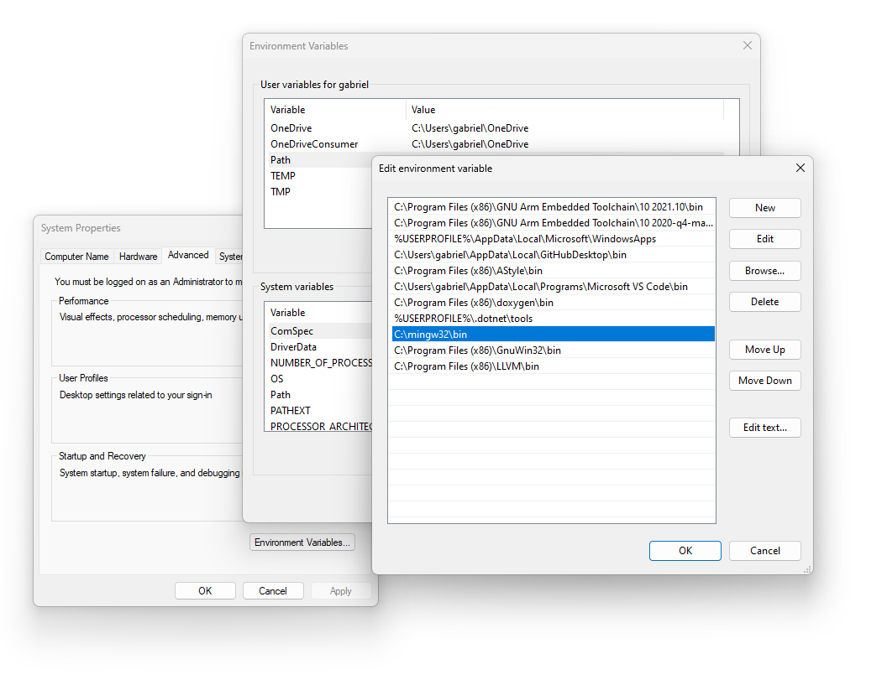
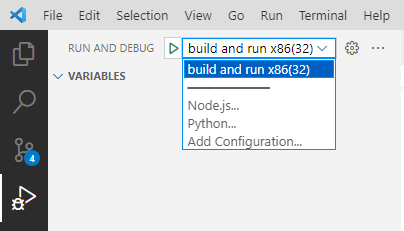
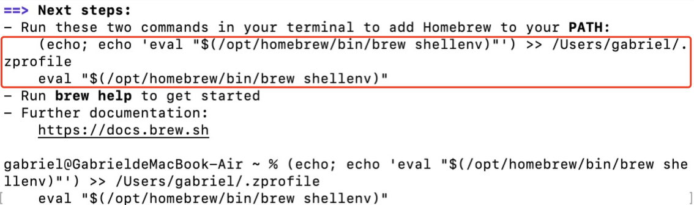
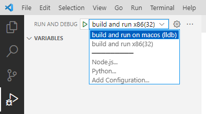

# How To Use


## 1 Overview

You can use this project as a template for developing arm-2d based GUI applications on PC.

### **Feature**

- **Support Windows, Linux and MacOS**
- **Develop arm-2d GUI applications in VSCode**
- **Compile and run natively on the PC** platform (this isn't a simulation)
- **Use the same set of methods for microcontrollers** on PC to develop arm-2d-based GUI applications
- **Develop on PC and run on MCU**
  - The **application code and the resource files can be used directly on MCU** as they are hardware independent.


## 2 How to Build

This example project supports **Windows**, **Linux** and **MacOS**. Please follow the corresponding guidance for your environment.

### 2.1 For Windows

#### 2.1.1 Install GCC (mingw32) and Make

Second, please 

- Download and install GCC. You **MUST** download the [latest mingw32](https://github.com/niXman/mingw-builds-binaries/releases/). For example, [i686-13.1.0-release-posix-dwarf-ucrt-rt_v11-rev1.7z](https://github.com/niXman/mingw-builds-binaries/releases/download/13.1.0-rt_v11-rev1/i686-13.1.0-release-posix-dwarf-ucrt-rt_v11-rev1.7z) Unzip the package and copy it to your desired location. 
- [Download](https://gnuwin32.sourceforge.net/packages/make.htm) and install Make.

**NOTE**: Please ensure you have correctly set the **PATH** variable in the Windows environment for GCC and Make. After installation, you may need to restart your computer to ensure the new environment variable settings take effect.

 


#### 2.1.2 Open the Project

Finally, please open the project in VSCode. You can do this by choosing "**Open Workspace from File**"  in the File menu in VSCode and then selecting the workspace file `[template][pc][vscode].code-workspace` .

In "**Run and Debug**" panel, you can run the project via "**build and run x86(32)**" or you can press "**F5**" to launch a debug session.

 


### 2.2 For Linux

#### 2.2.1 Install the required components

Second, please install the required modules with the following command:

```sh
sudo apt-get update && sudo apt-get install -y build-essential libsdl2-dev
```


#### 2.2.2 Open the Project

Finally, please open the project in VSCode. You can do this by choosing "**Open Workspace from File**"  in the File menu in VSCode and then selecting the workspace file `[template][pc][vscode].code-workspace` .

In "**Run and Debug**" panel, you can run the project via "**build and run x86(32)**" or you can press "**F5**" to launch a debug session.

 


### 2.3 For MacOS

#### 2.3.1 Install the homebrew and sdl2

Second, please open the terminal in MacOS and [install the homebrew](https://brew.sh/) with the following command:

```sh
/bin/bash -c "$(curl -fsSL https://raw.githubusercontent.com/Homebrew/install/HEAD/install.sh)"
```

After a successful installation, you should find an important message on the terminal that is similar to the following:



Please copy the part in the red box and paste to the shell to "**add Howbrew to your PATH**". 

**NOTE**: Your command line will be different from mine as it contains the user name of the machine. 


After that, please install sdl2 with the following command:

```sh
brew install sdl2
```


#### 2.3.2 Open the Project

Finally, please open the project in VSCode. You can do this by choosing "**Open Workspace from File**"  in the File menu in VSCode and then selecting the workspace file `[template][pc][vscode].code-workspace` .

In "**Run and Debug**" panel, you can run the project via "**build and run on macos (lldb)**" or you can press "**F5**" to launch a debug session.

 


Now, you should be ready to start using the `[template][pc][vscode]` project. If you encounter any issues, feel free to ask for help.

Enjoy.


## 3 How To Configure the Project

### 3.1 How to change screen size

You can change the screen size by updating the macro `__DISP0_CFG_SCEEN_WIDTH__` and `__DISP0_CFG_SCEEN_HEIGHT__` defined in `platform\arm_2d_disp_adapter_0.h`.

If you want to run benchmark, please also update the macro `__GLCD_CFG_SCEEN_WIDTH__` and `__GLCD_CFG_SCEEN_HEIGHT__` defined in `platform\arm_2d_cfg.h`.


### 3.2 How to change the colour depth (bits per pixel)

The supported colour depths (i.e. the bits per pixels) are **8bit (GRAY8)**, **16bit (RGB565)** and **32bit (CCCN888)**. You can change the colour depth by updating the macro `__DISP0_CFG_COLOUR_DEPTH__` defined in `platform\arm_2d_disp_adapter_0.h` and the macro `__GLCD_CFG_COLOUR_DEPTH__` defined in `platform\arm_2d_cfg.h`. The available values are `8`, `16` and `32`.


### 3.3 How to update the project with new source files, search path etc.

Any source files and header files placed at the root of the project will be included into compilation automatically. 

If you want to introduce new folders, please update the Makefile accordingly:

```makefile
CC_SRC  := $(wildcard *.c)
CC_SRC  += $(wildcard platform/*.c)
CC_SRC  += $(wildcard platform/math/*.c)
CC_SRC  += $(wildcard ../../Library/Source/*.c)
CC_SRC  += $(wildcard ../../Helper/Source/*.c)
CC_SRC  += $(wildcard ../../examples/common/asset/*.c)
CC_SRC  += $(wildcard ../../examples/common/benchmark/*.c)
CC_SRC  += $(wildcard ../../examples/common/controls/*.c)

CC_INC  := .
CC_INC  += platform
CC_INC  += platform/math
CC_INC  += platform/math/dsp
CC_INC  += ../../Library/Include
CC_INC  += ../../Helper/Include
CC_INC  += ../../examples/common/benchmark
CC_INC  += ../../examples/common/controls

CC_DEF  := ARM_SECTION\(x\)=
CC_DEF  += __va_list=va_list
```


To enable the **intelliSense** working properly, please also update the `.vscode\c_cpp_properties.json` accordingly:

```json
{
    "configurations": [
        {
            ...
            "includePath": [
                "${workspaceFolder}/**",
                "${workspaceFolder}/sdl2/32/include",
                "${workspaceFolder}/platform",
                "${workspaceFolder}/platform/math",
                "${workspaceFolder}/platform/math/dsp",
                "${workspaceFolder}/../../Helper/Include",
                "${workspaceFolder}/../../Library/Include",
                "${workspaceFolder}/../../examples/common/benchmark",
                "${workspaceFolder}/../../examples/common/controls"
            ],
            "defines": [
                "_DEBUG",
                "UNICODE",
                "_UNICODE",
                "ARM_SECTION(x)=  ",
                "__va_list=va_list"
            ],
            ...
        }
    ],
    "version": 4
}
```


### 3.4 How to run benchmarks

Arm-2D provides two benchmark: **Generic** and **WatchPanel**. For details, please check [here](../common/benchmark/README.md). You can run those benchmarks in this project template. In the header file  `platform/RTE_Components.h`, there are three macros:


```c
#ifndef RTE_COMPONENTS_H
#define RTE_COMPONENTS_H

/*
 * Define the Device Header File: 
 */
#define CMSIS_device_header "stdint.h"

//#define RTE_Acceleration_Arm_2D_Extra_Benchmark
//    #define RTE_Acceleration_Arm_2D_Extra_Benchmark_Generic
//    #define RTE_Acceleration_Arm_2D_Extra_Benchmark_Watch_Panel

...
```


If you want to run the **Generic** benchmark, please uncomment the macro `RTE_Acceleration_Arm_2D_Extra_Benchmark` and `RTE_Acceleration_Arm_2D_Extra_Benchmark_Generic`.

If you want to run the **WatchPanel** benchmark, please uncomment the macro `RTE_Acceleration_Arm_2D_Extra_Benchmark` and `RTE_Acceleration_Arm_2D_Extra_Benchmark_Watch_Panel`.

**NOTE**:

1. You should NOT define macros `RTE_Acceleration_Arm_2D_Extra_Benchmark_Generic` and `RTE_Acceleration_Arm_2D_Extra_Benchmark_Watch_Panel` at the same time.

2. You can find the configurations of benchmarks in `platform/arm_2d_cfg.h`.

3. The corresonponding code to run the benchmark is the following (in `main.c`):

   ```c
   #ifdef RTE_Acceleration_Arm_2D_Extra_Benchmark
   #   include "arm_2d_benchmark.h"
   #endif
   ...
   
   int app_2d_main_thread (void *argument)
   {
   #ifdef RTE_Acceleration_Arm_2D_Extra_Benchmark
       arm_2d_run_benchmark();
   #else
       arm_2d_scene_player_register_before_switching_event_handler(
               &DISP0_ADAPTER,
               before_scene_switching_handler);
       
       arm_2d_scene_player_set_switching_mode( &DISP0_ADAPTER,
                                               ARM_2D_SCENE_SWITCH_MODE_FADE_WHITE);
       arm_2d_scene_player_set_switching_period(&DISP0_ADAPTER, 3000);
       
       arm_2d_scene_player_switch_to_next_scene(&DISP0_ADAPTER);
   #endif
   
       while(1) {
           if (arm_fsm_rt_cpl == disp_adapter0_task()) {
               VT_sdl_flush(1);
           }
       }
   
       return 0;
   }
   ```

   As you can see, when we define the macro `RTE_Acceleration_Arm_2D_Extra_Benchmark`, the function `arm_2d_run_benchmark` (defined in `arm_2d_benchmark.h`) will be called. 
