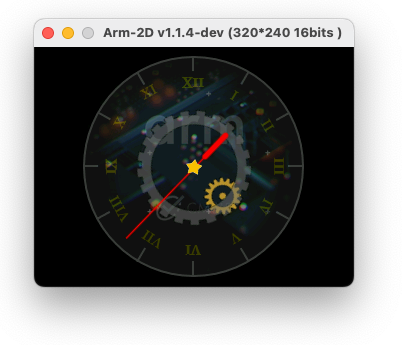

# How to build Arm-2D Application Demos with CMSIS build tools

## 1 Overview

Details about the 2 [demos](https://github.com/ARM-software/Arm-2D/tree/main/examples):

- **Generic Benchmark**:
  - Background with Texture paving (switching different mirroring modes every 4 second)
  - Foreground picture
  - Two constructed layers for alpha-blending and texture paving
  - Moving icons
  - Spinning busy wheel


- **watch_panel**
  - A floating background layer (Using Tile Copy)
  - A clock_panel layer (Using Alpha Blending with Colour Keying)
  - A small gold gear (Rotation)
  - A big black gear (Rotation with Opacity)
  - A red pointer (Rotation)
  - A golden star (Rotation, scaling with Opacity)



## 2 Install CMSIS Build tools

see : https://github.com/Open-CMSIS-Pack/cmsis-toolbox/blob/main/docs/installation.md

For now, please use version **1.4.0**

### 2.1 For Linux

```bash
~ $ wget https://github.com/Open-CMSIS-Pack/cmsis-toolbox/releases/download/1.4.0/cmsis-toolbox-linux64.tar.gz
```

Decompress it in your workspace and setup environment variables as described in the link above

```bash
~ $ tar -zxvf cmsis-toolbox-linux64.tar.gz
~ $ export PATH=$PATH:<your_cmsis_tool_path>/cmsis-toolbox-linux64/bin/
~ $ export CMSIS_COMPILER_ROOT=<your_cmsis_tool_path>/cmsis-toolbox-linux64/etc/
~ $ export CMSIS_PACK_ROOT=<your_cmsis_pack_storage_path>cmsis-pack
```

In case not already done, load and setup **Arm Compiler 6.18** or later

Then report the tool path in : `<your_cmsis_tool_path>/cmsis-toolbox-linux64/etc/AC6.6.18.0.cmake`

```makefile
 ############### EDIT BELOW ###############
# Set base directory of toolchain
set(TOOLCHAIN_ROOT "<arm_compiler_6_path>/bin/")
set(EXT)

############ DO NOT EDIT BELOW ###########
```

Initialize the new pack repository

```bash
~ $ cpackget init https://www.keil.com/pack/index.pidx
```

### 2.2 For Windows

To be completed...

## 3 Build the project

### 3.1 Generate list of needed packs

From this `Arm-2D_Demos` folder, type the command:

```bash
./test $ csolution list packs -s arm2d.csolution.yml -m > required_packs.txt
```


### 3.2 Install the packs

```bash
./test $ cpackget add -f required_packs.txt
```


### 3.3 Convert csolution

Activate your preferred `<compiler>` (Arm Compiler 6 `ac6`, GNU Compiler `gcc`, or IAR Compiler `iar`)
by creating a copy of the according `.cdefault.yml` file.
Run `csolution` to generate the build configurations for all available settings or for your preferred `<project>`
(`generic`, or `smartwatch`), `<config>` (`Debug`, or `Release`), and target device (`VHT_M7`, `VHT_M33`, `VHT_M55`,
`VHT-Corstone-300`, or `VHT-Corstone-310`).

```bash
./test $ cp arm2d.<compiler>-cdefault.yml arm2d.cdefault.yml
./test $ csolution convert -s arm2d.csolution.yml [-c arm2d_<project>.<config>+<target>]
```

It will generate several project files:

- For each project (here there are 2, one for the Generic Bench and one for the Watchpanel demo)
- For each target : CS300, CS310 ...

Expected output:

```bash
./test $ find . -name *.cprj
arm2d_<project>.<config>+<target>-<compiler>/arm2d_<project>.<config>+<target>.cprj
```

### 3.4 Build the cprj file

To build the projects:

```bash
./test $ cbuild arm2d_<project>.<config>+<target>-<compiler>/arm2d_<project>.<config>+<target>.cprj
```

## 4 Run the applications

To be completed...

It should take a few minutes and display at the end:

```bash
./test $ <VHT executable> -q --simlimit 200 -f <model config> \
  -a arm2d_<project>.<config>+<target>-<compiler>/outdir/arm2d_<project>.<config>+<target>.axf
telnetterminal0: Listening for serial connection on port 5000
telnetterminal2: Listening for serial connection on port 5001
telnetterminal1: Listening for serial connection on port 5002
start GENERIC_BLENDING benchmark
finished in 112373486 cycles
Info: /OSCI/SystemC: Simulation stopped by user.
```

## 5 Using `build.py` for building and running

Using the `build.py` script offers a unified command line interface to run the above steps
conveniently.

### 5.1 Prerequisites

The Python script requires a Python 3.8 or later installation. And the Python package `python-matrix-runner`
which can be installed with the following command:

```bash
~ $ pip install -U python-matrix-runner
```

### 5.2 Build and run

```bash
./test $ ./build.py [--verbose] [-c <compiler>] [-d <target>] [-o <config>] [-p <project>] [build] [run]
  --verbose       Show detailed build output
  -c <compiler>   Select compiler(s) to be used: AC6, GCC, IAR
  -d <target>     Select target device(s) to be used: CM7, CM33, CM55, SSE300, SSE310
  -o <config>     Select build configuration(s) to be use: Debug, Release
  -p <project>    Select project(s) to be used: generic, smartwatch
  build           Execute the build stage
  run             Execute the run stage
```

The flags `-c`, `-d`, `-o`, and `-p` can be given multiple times. `build.py` will run all requested stages
for all permutations of selected configurations in a row. Omitted settings default to *all available*.

## 6 Customizations

- Applications are currently running **3** iterations, but this can be customized in the **arm2d.csolution.yml** file

  This generates respectively approx **2.7M** and **4M** instructions for the smartwatch and generic applications.

```yaml
  define:
    - ITERATION_CNT=3
    - __ARM_2D_CFG_BENCHMARK_EXIT_WHEN_FINISH__
```

## 7 Appendix

### 7.1 Files

- **arm2d.csolution.yml**
  Solution files describing all the solutions and the common settings
- **arm2d.ac6-cdefault.yml**, **arm2d.gcc-cdefault.yml**, and **arm2d.iar-cdefault.yml**
  Compiler specific settings for Arm Compiler 6, GNU Compiler, and IAR Compiler, respectively.
- **arm2d_smartwtach.cproject.yml** and **arm2d_generic.cproject.yml**
  The project describing the source files, components and layers
- **boot.clayer.yml**
  Boot code for SC300, SC310 or normal M4, M7 etc ...
